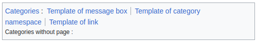
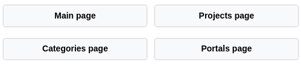
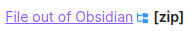
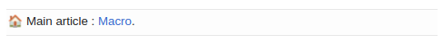
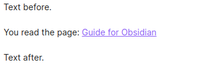
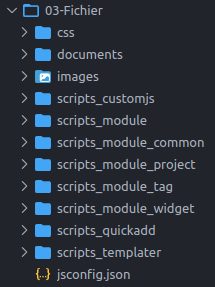
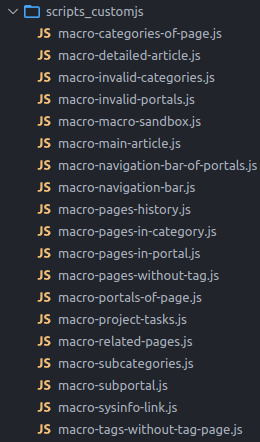
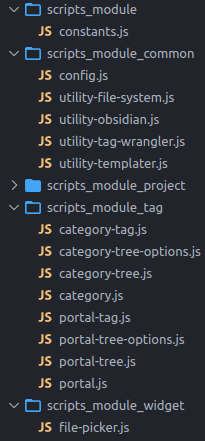
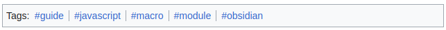

# Guide pour développer et exécuter du JavaScript modulaire dans Obsidian

Alors que le Markdown ne permet de produire que des contenus statiques, le JavaScript **démultiplie les possibilités d'Obsidian** en permettant des rendus dynamiques. Son impact sur les performances est faible et il limite le besoin de recourir à des plugins supplémentaires pour ajouter des fonctionnalités. De plus, si le code est correctement structuré en fonctions JavaScript et externalisé dans des scripts externes, alors il **maintient l'interopérabilité des fichiers markdown** pour le cas où vous souhaiteriez migrer en dehors d'Obsidian. En effet, il ne devient plus nécessaire de parcourir les fichiers markdown pour les modifier et les adapter, puisqu'il suffit seulement de réimplémenter les quelques fonctions JavaScript situées dans les fichiers de script. Ce sont ces aspects que nous allons explorer dans ce guide.

Voici quelques exemples de rendus réalisés à l'aide de scripts JavaScript avec leur code d'appel depuis les pages markdown, qu'il serait fastidieux à produire en pure Markdown :

- `Catégories de la page` (inspiré de Wikipédia, je l'utilise en pied-de-page sur toutes mes pages)

```js
await customJS.MacroCategoriesOfPage.listInBox(<dataview-plugin>, "<path-to-page>");
```



- `Barre de navigation` ([inspiré de Wikipédia](https://fr.wikipedia.org/wiki/Projet:Portail_et_projet/Onglets), je l'utilise en en-tête de page sur certaines pages)

```js
await customJS.MacroNavigationBar.forWelcomePage(<dataview-plugin>);
```



- `Lien dynamique` (le lien pointe vers un fichier local situé hors d'Obsidian et sa racine varie selon l'OS, ce qui est impossible à faire en markdown)

```js
customJS.MacroSysinfoLink.onTextToFile("<link-text>", "partial-path-to-file", "<file-format-indicator>")
```



- `Article principal` ([inspiré de Wikipédia](https://en.wikipedia.org/wiki/Template:Category_main_article))

```js
await customJS.MacroMainArticle.displayInBox(<plugin-dataview>, "<path-to-page>", "<link-text>");
```



## Introduction

Pour structurer le code JavaScript dans Obsidian et éviter de polluer les fichiers markdown, une bonne pratique est de l'externaliser dans des fichiers de script interconnectés, et de former des classes d'objets représentant des entités conceptuelles dont certaines fonctions seulement seront appelées dans les pages. Ces classes seront de deux types :

- les **modules** : non destinées à être utilisées directement dans les fichiers markdown, ces classes encapsulent la logique métier et mettent à disposition de macros leurs fonctions de service.
- les **macros** : ces classes font l'interface entre les modules et les fichiers markdown, et leur rôle consiste principalement à réaliser des rendus en HTML. Leurs fonctions sont invoquées dans les pages à l'aide du [plugin CustomJS](https://github.com/saml-dev/obsidian-custom-js).

Dans ce guide, nous verrons comment exécuter du code JavaScript dans des fichiers Markdown d'Obsidian, et comment mettre en place un système de macro Obsidian pour externaliser le code dans des fichiers de script dédiés et gérer leurs dépendances. Par ailleurs, pour faciliter l'écriture de ce code, nous verrons comment configurer un environnement de développement.

Le **système de macro** proposé n'a rien de révolutionnaire techniquement. Il est surtout une méthode d'organisation pour Obsidian visant à standardiser et à externaliser vos fonctions JavaScript, afin de diminuer la redondance de code et minimiser les temps de maintenance.  Il est directement inspiré du [système de module et de modèle de Wikipédia](https://en.wikipedia.org/wiki/Wikipedia:Templates).

### Prérequis

Ce guide s'adresse à des gens déjà un peu familiers avec Obsidian et qui disposent de quelques connaissances en JavaScript et en développement logiciel. Pas besoin d'être un ingénieur logiciel, mais au moins avoir déjà développé un peu en JavaScript et optionnellement savoir ce qu'est un [IDE](https://en.wikipedia.org/wiki/Integrated_development_environment) et notamment [Visual Studio Code](https://code.visualstudio.com/).

Pour ce guide, il est **nécessaire d'installer** :

- le plugin Obsidian [*Dataview*](https://blacksmithgu.github.io/obsidian-dataview/) pour exécuter du JavaScript dans les pages markdown,
- le plugin Obsidian [*CustomJS*](https://github.com/saml-dev/obsidian-custom-js) pour externaliser le code JavaScript et l'appeler.

Si vous souhaitez configurer un environnement de développement, il faut **optionnellement installer** :

- l'IDE [Visual Studio Code](https://code.visualstudio.com/).
- l'environnement [NodeJS](https://docs.npmjs.com/downloading-and-installing-node-js-and-npm) (optionnel mais recommandé pour bénéficier de l'auto-complétion de l'API Obsidian dans l'IDE).

## Exécuter du code JavaScript dans Obsidian

Le plugin Dataview propose [deux syntaxes](https://blacksmithgu.github.io/obsidian-dataview/queries/dql-js-inline/#dataview-js) pour intégrer du JavaScript dans un fichier markdown.

La **première syntaxe** produit un rendu dans un bloc dédié (une `div`) qui est séparé du texte situé avant et après :

````markdown
```dataviewjs
// here my code
```
````

Par exemple le code markdown suivant :

````markdown
Text before.

```dataviewjs
dv.span("You read the page: " + dv.fileLink(dv.current().file.path, false, "Guide for Obsidian")) + ".";
```

Text after.
````

Affiche :



La **deuxième syntaxe** est appelé *inline* et produit un rendu au sein du texte situé avant et après :

```markdown
`$= // here my code`
```

Par exemple l'extrait markdown :

````markdown
Text before. `$= "You read the page: " + dv.fileLink(dv.current().file.path, false, "Guide for Obsidian") + ".";` Text after.
````

Affiche :


Le **code s'exécute lors du passage en vue *Live preview* ou *Reading***. Il est donc recommandé de l'écrire en vue *Source mode*.

Pour des raisons de performance, le code n'est pas réinterprété lors de chaque changement de vue, mais à intervalle régulier ou lors de modifications.

> [!tip] Astuce
> Pour forcer la réinterprétation du code sans le modifier, ajouter à la fin d'une ligne le caractère `;`. Ce caractère est facultatif en JavaScript et peut se retrouver en de multiples exemplaires à la suite sans poser de problème. Puis quand vos tests sont terminés, supprimer les caractères en excédents.

## Externaliser le code JavaScript dans des fichiers de script

Écrire la totalité du code JavaScript uniquement dans les fichiers markdown va vite vos fichiers rendre illisibles, et surtout, rendre la maintenance du code difficile et entraîner beaucoup de redondance. C'est pourquoi il est recommandé de le déplacer dans des fichiers de script situés dans un sous-dossier du vault Obsidian, puis de les invoquer dans les pages markdown grâce au [plugin CustomJS](https://github.com/saml-dev/obsidian-custom-js).

La **démarche pour externaliser du code** est la suivante :

1. Dans Obsidian, créer un sous-dossier destiné à accueillir les fichiers JavaScript. Par exemple dans mon cas il s'agit de `03-Files/scripts_customjs`, à coté de mes autres assets.

    

2. Dans les options d'Obsidian, aller dans les paramètres de configuration CustomJS.

3. Initialiser le paramètre *Folder* avec le chemin vers le dossier créé précédemment (par exemple `03-Files/scripts_customjs`). Fermer la fenêtre des options.

4. A l'aide de l'explorateur de fichier, ouvrir ce dossier, puis créer un nouveau fichier suffixé par l'extension `.js`. Par exemple `my-script.js`. Le nom de fichier *ne doit contenir* aucun espace et aucun caractère spécial.

5. Avec un éditeur de texte ou un logiciel d'édition de code, ouvrir ce fichier, puis y coller le code de démonstration suivant :

    ```js
    class MacroGuide {
      /**
      * @param {object} dv DataView object of Obsidian extension.
      */
      helloWorld(dv) {
        const { obsidian, app } = self.customJS || {};
        if (obsidian == null || app == null) throw new Error("customJS is null.");

        dv.span(
          "You read the page: " +
            dv.fileLink(dv.current().file.path, false, "Guide for Obsidian")
        ) + ".";
      }
    }
    ```

6. Sauvegarder et fermer l'éditeur de texte.

7. Dans une page Obsidian, insérer le code d'invocation de script suivant :

    ````js
    ```dataviewjs
    customJS.MacroGuide.helloWorld(dv);
    ```
    ````

8. Passer en vue *Live Preview* ou *Reading* pour visualiser le rendu. Il doit s'afficher une phrase contenant un lien vers la page courante. Le rendu est identique à la première méthode, mais cette fois la logique métier est externalisée.

Dans la démarche présentée dans ce guide, nous allons une **macro** toute classe JavaScript qui peut être instanciée et invoquée directement dans une page markdown d'Obsidian.

**Quelques remarques :**

A l'étape 6 on peut voir que la fonction `helloWorld()` est **encapsulée dans une classe**. Il s'agit d'une contrainte imposée par CustomJS, qui déclenchera une erreur si elle n'est pas respectée. De toute manière, même si ce n'était pas le cas, cette pratique est vivement recommandée pour profiter des avantages de lisibilité offerts par le paradigme Objet.

Second point, le plugin CustomJS donne accès à [deux objets](https://github.com/saml-dev/obsidian-custom-js) essentiels pour interagir avec Obsidian :

- `customJS.obsidian` : permet d'accéder à l'[API Obsidian](https://github.com/obsidianmd/obsidian-api/blob/master/obsidian.d.ts) .
- `customJS.app` : permet d'accéder à l'[objet App](https://docs.obsidian.md/Reference/TypeScript+API/App).

Enfin, pour **accéder à l'objet Dataview depuis une fonction**, il faut lui passer en paramètre la variable globale `dv`.

## Configurer l'environnement de développement

**Note :** cette partie est facultative. Si vous ne souhaitez pas travailler avec un IDE, vous pouvez passer directement à la partie suivante.

Écrire du code JavaScript dans un simple éditeur de texte va vite devenir fastidieux et être source de nombreuses sources d'erreurs de syntaxe sans outil de contrôle. L'avantage d'un IDE comme [Visual Studio Code pour JavaScript](https://code.visualstudio.com/docs/languages/javascript) est d'offrir une coloration syntaxique, mais surtout, des **mécanismes d'[auto-complétion](https://en.wikipedia.org/wiki/Autocomplete)** qui vont faire gagner un temps phénoménal.

La procédure à suivre pour **configurer l'environnement de développement** est la suivante :

1. Depuis un terminal, installer le package NodeJS [`Obsidian API`](https://www.npmjs.com/package/obsidian).

2. Lancer Visual Studio Code, puis ouvrir le dossier de votre vault Obsidian.

3. Dans le dossier où se trouve déjà le dossier des scripts CustomJS,créer le fichier `jsconfig.json`. Il permet de [configurer un projet JavaScript dans VS Code](https://code.visualstudio.com/docs/languages/jsconfig) pour bénéficier de l'auto-complétion aec l'API Obsidian et JavaScript

4. Coller dans ce fichier le contenu suivant :

    ```json
    {
      "compilerOptions": {
        "module": "ESNext",
        "moduleResolution": "Bundler",
        "target": "ES2022",
        "jsx": "react",
        "allowImportingTsExtensions": true,
        "checkJs": true,
        "allowJs": true,
        "experimentalDecorators": true,
        "strictNullChecks": true,
        "strictFunctionTypes": true,
        "baseUrl": ".",
        "paths": {
          "obsidian": ["../../../../../.nvm/versions/node/v20.13.1/lib/node_modules/obsidian/obsidian.d.ts"],
          "custom-js": ["../.obsidian/plugins/customjs/types.d.ts"]
        }
      },
      "exclude": [
        "node_modules",
        "**/node_modules/*"
      ]
    }
    ```

5. Dans le variable `obsidian`, vérifier que le chemin pointe bien vers la définition des types du package NodeJS d'Obsidian.

Vous devriez à présent avoir l'auto-complétion lors des développements de scripts. Dans la suite du guide nous reviendrons modifier ce fichier pour y ajouter nos scripts de manière à avoir l'auto-complétion sur nos propres classes.

> [!tip] Suggestion
> Mettre au début de chaque fichier JavaScript l'instruction `// @ts-check` de manière à détecter les erreurs de syntaxe.

## Structurer ses scripts et gérer les dépendances

La [décomposition](<https://en.wikipedia.org/wiki/Decomposition_(computer_science)>) est un principe fondamental en l'ingénierie logicielle. Lorsqu'il est appliqué avec un langage objet comme le JavaScript moderne, il implique de subdiviser les domaines métiers en entités conceptuelles qu'on appelle des classes. Une classe regroupe et propose tous les services attendus sur une entité par l'intermédiaire de ses fonctions (ou méthodes). C'est ce que cette partie propose de mettre en place. Car ce paradigme améliore grandement la maintenabilité et la lisibilité du code en évitant beaucoup de redondance de code. Par contre, il va impliquer de devoir gérer des dépendances entres scripts.

Une bonne pratique d'ingénierie est d'avoir **une classe d'objet par fichier**. Pour rappel, dans ce système de macro, on distingue deux types de classes.

Les **classes de modules**, qui ne sont pas destinées à être utilisées directement dans les fichiers markdown, et qui encapsulent la logique métier et mettent à disposition des macros leurs fonctions de service. Et les **classes de macros**,  qui font l'interface entre les modules et les fichiers markdown à l'aide du [plugin CustomJS](https://github.com/saml-dev/obsidian-custom-js), et dont le rôle consiste principalement à réaliser des rendus en HTML.

Les **macros** sont toutes situées dans l'unique dossier configuré dans customJS :



Quant aux **modules**, ils sont regroupés par domaine métier dans des dossiers situés à côté de celui des macros. Par exemple :



L'**import et l'export de script** se fait au moyen du [mécanise d'import/export](https://developer.mozilla.org/en-US/docs/Web/JavaScript/Guide/Modules) fourni par l'API JavaScript. Sauf que là où les simples mots-clés `export/import` ou `require` suffisent en pure JavaScript, la permissivité du plugin customJS implique d'utiliser un méthode détournée que nous verrons plus loin.

### Nommer les dossiers de module

Les dossiers de module peuvent être nommés n'importe comment à condition de **partager un préfixe commun** pour le mécanisme d'import/export, et de n'avoir aucun espace ou caractère spécial.

J'ai choisi la convention `scripts_module_<domain>`.

### Centraliser ses configurations

Il peut être pertinent de créer un script de configuration pour les scripts, qui centralise les principales informations du vault Obsidian de manière à diminuer l'impact qu'une évolution de ce dernier aurait sur le code. Je recommande d'y mettre au moins les chemins des principaux dossiers.

Son chemin peut être `scripts_module_common/config.js` et sa structure minimale :

```js
/**
 * @description Module for all config variables.
 * @module Config
 */

// @ts-check

module.exports = {
  myVar: "my-value"
};
```

> [!EXAMPLE]- Exemple de fichier de configuration
>
> ```js
> /**
>  * @description Module for all config variables.
>  * @module Config
>  */
> 
> // @ts-check
> 
> module.exports = {
>   obsidianFolderPaths: {
>     article: "01-Articles",
>     project: "02-Projects",
>     file: "03-Files",
>     tags: "04-Tags",
>     template: "05-Templates",
>     templateSource: "05-Templates/Source",
>     special: "06-Special",
>     user: "07-User",
>     help: "08-Help",
>     archives: "09-Archives",
>   },
>   fsRootPaths: {
>     linux: "/home/name/", // Root path on Linux File System
>     windows: "%userprofile%/", // Root path on Windows File System
>     android: "", // Root path on Android File System
>     mac: "", // Root path on Mac File System
>     ios: "", // Root path on iOS File System
>   },
> };
> ```

### Exporter un script

L'export se fait en utilisant la syntaxe `module.exports = ...` de la [spécification CommonJS](https://flaviocopes.com/commonjs/) utilisée dans [NodeJS](https://nodejs.org/api/modules.html#exports-shortcut), à placer de préférence à la fin du fichier :

```js
class MyClass {
// my code
}

module.exports = MyClass;
```

Il est possible d'exporter plusieurs valeurs en créant un objet littéral JavaScript :

```js
class MyClass {
// my code
}
const MY_CONST = "value";

module.exports = {
  MyClass,
  MY_CONST,
  myVar: "value",
}
```

Malgré de nombreux essais, la syntaxe d'ES6 pour l'import/export ne semble pas permise par le plugin CustomJS. Seule celle de NodeJS fonctionne.

### Importer un script

Alors qu'en pure JavaScript l'import se fait facilement à l'aide des mots-clés `import` ou `require`, CustomJS soulève une erreur lors de leur utilisation. Il faut donc ruser un peu et encapsuler la fonction `require` dans une autre fonction statique.

```js
/**
 * @param {string} moduleFolderSuffix Suffixe name of one of folder module in `/03-Files/scripts_module_<suffixe>/` folders.
 * @param {string} moduleFile Name of the file module in the `/03-Files/scripts_module_<suffixe>/` folder.
 * @returns {any} Exported module.
 */
static importModule(moduleFolderSuffix, moduleFile) {
  const { obsidian, app } = self.customJS || {};
  if (obsidian == null || app == null) throw new Error("customJS is null.");
  let adapter = app.vault.adapter;
  if (adapter instanceof obsidian.FileSystemAdapter) {
    const modulePath =
      adapter.getBasePath() +
      "/03-Files/scripts_module_" +
      moduleFolderSuffix +
      "/" +
      moduleFile;
    delete global.require.cache[global.require.resolve(modulePath)];
    return require(modulePath);
  }
  throw new Error("Obsidian adapter is not a FileSystemAdapter.");
}
```

La fonction `importModule()` va automatiquement chercher les modules dans les sous-dossiers de `03-Files` préfixés par `scripts_module_`. Ce préfixe ayant été déterminé dans la partie précédente, il faut penser à modifier ce code en conséquence.

L'**intégration `importModule` dans un fichier** peut se faire de deux manières :

- Directement en tant que fonction dans la classe principale.

    ```js
    class MacroGuide {
      /* -------------------------------------------------------------------------- */
      /*                                Import Section                              */
      /* -------------------------------------------------------------------------- */
      static importModule(moduleFolderSuffix, moduleFile) {
        // Code of function
      }
      /* -------------------------------------------------------------------------- */

      /**
      * @param {object} dv DataView object of Obisidian extension.
      */
      helloWorld(dv) {
        // My code
      }
    }
    ```

- Ou dans une classe spécifique située avant la classe principale, sachant que cette option **ne fonctionne que pour les classes situées en dehors du dossier de CustomJS** (`scripts_customjs` dans cet article).

    ```js
    /* -------------------------------------------------------------------------- */
    /*                                Import Section                              */
    /* -------------------------------------------------------------------------- */

    class ModuleLoader {
      static importModule(moduleFolderSuffix, moduleFile) {
        // Code of function
      }
    }
    /* -------------------------------------------------------------------------- */

    class ClassOfModule {
      /**
      * @param {object} dv DataView object of Obisidian extension.
      */
      helloWorld(dv) {
        // My code
      }
    }
    ```

L'**utilisation de la fonction `importModule()`** pour importer une classe se fait presque de la même manière qu'en pure JavaScript, c'est-à-dire en initialisant une variable par un appel à la fonction dans la section d'import. Cette variable s'utilise ensuite comme en pure JavaScript.

- Dans le cas où vous aviez choisi la première option :

    ```js
    class MacroGuide {
      /* -------------------------------------------------------------------------- */
      /*                                Import Section                              */
      /* -------------------------------------------------------------------------- */
      static importModule(moduleFolderSuffix, moduleFile) {
        // Code of function
      }
      
      Obsidian = MacroGuide.importModule(
        "common",
        "utility-obsidian.js"
      ); // Here I import the class UtilityObsidian presented in the appendix of this article.
      /* -------------------------------------------------------------------------- */
      
      /**
      * @param {object} dv DataView object of Obisidian extension.
      */
      helloWorld(dv) {
        // To call a static function
        const page = this.Obsidian.getFileByPath();

        // To instanciate a class
        const myObsidianObject = new this.Obsidian();
      }
    }
    ```

- Dans le cas où vous aviez choisi la deuxième option :

    ```js
    /* -------------------------------------------------------------------------- */
    /*                                Import Section                              */
    /* -------------------------------------------------------------------------- */

    class ModuleLoader {
      static importModule(moduleFolderSuffix, moduleFile) {
        // Code of function
      }
    }

    Obsidian = ModuleLoader.importModule(
        "common",
        "utility-obsidian.js"
      ); // Here I import the class UtilityObsidian presented in the appendix of this article.
    /* -------------------------------------------------------------------------- */

    class ClassOfModule {
      /**
      * @param {object} dv DataView object of Obisidian extension.
      */
      helloWorld(dv) {
        // To call a static function
        const page = Obsidian.getFileByPath();

        // To instanciate a class
        const myObsidianObject = new Obsidian();
      }
    }
    ```

> [!info] Paquets externes
> Il est possible d'importer n'importe quel module NodeJS ou paquet (`node:path`, `luxon`, etc.), à condition qu'il ait déjà été importé par un plugin Obsidian. Pour cela, il faut utiliser directement la syntaxe de NodeJS. Par exemple : `const path = require("node:path");`.

### Configurer l'IDE pour l'auto-complétion

**Note :** cette partie est facultative et n'est à suivre que si vous avez suivi la partie précédente sur la configuration de l'IDE.

Du fait de ne pas pouvoir utiliser la manière standard d'importer des objets JavaScript, l'IDE est incapable de proposer de l'auto-complétion. Vous devriez également avoir du surlignage en rouge un peu partout. Pour l'activer, il est nécessaire de réaliser quelques manipulations, et notamment avec [JSDoc](https://jsdoc.app/).

Pour chaque fichier avec des exports :

1. Ouvrir le fichier `jsconig.json`, et indiquer dans la variable `path` un alias d'import et le chemin vers le fichier à importer. Par exemple :

    ```json
    {
      "compilerOptions": {
        "paths": {
          "obsidian": ["../../../../../.nvm/versions/node/v20.13.1/lib/node_modules/obsidian/obsidian.d.ts"],
          "moment": ["../../../../../.nvm/versions/node/v20.13.1/lib/node_modules/moment/moment.d.ts"],
          "custom-js": ["../.obsidian/plugins/customjs/types.d.ts"],
          "module-category": ["scripts_module_tag/category.js"],
          "module-utility-obsidian": ["scripts_module_common/utility-obsidian.js"]
        }
      }
    }
    ```

2. Dans le fichier JavaScript qui importe, ajouter tout en haut de la section d'import une [déclaration `@typedef`](https://jsdoc.app/tags-typedef) avec l'alias d'import spécifié à l'étape précédente, de la forme `/** @typedef {import('alias')} Type */`. Par exemple :

    ```js
    /* -------------------------------------------------------------------------- */
    /*                                Import Section                              */
    /* -------------------------------------------------------------------------- */

    /**
    * @typedef {import('custom-js')} CustomJS
    * @typedef {import('obsidian')} Obsidian
    * @typedef {import('obsidian').App} App
    * @typedef {import('obsidian').Notice} Notice
    * @typedef {import('obsidian').TAbstractFile} TAbstractFile
    * @typedef {import('obsidian').TFile} TFile
    * @typedef {import('obsidian').TFolder} TFolder
    * @typedef {import('module-category')} Category
    */

    // Declaration of `static importModule(moduleFolderSuffix, moduleFile){}`
    /* -------------------------------------------------------------------------- */
    ```

3. Dans le même fichier, mais cette fois à la fin de la section d'import, ajouter au-dessus des initialisations de variable par un appel à la fonction `importModule()` une [déclaration `@type`](https://jsdoc.app/tags-type) de la forme `/** @type {typeof import('alias')} */`. Par exemple :

    ```js
    /* -------------------------------------------------------------------------- */
    /*                                Import Section                              */
    /* -------------------------------------------------------------------------- */

    /**
    * @typedef {import('custom-js')} CustomJS
    * @typedef {import('obsidian')} Obsidian
    * @typedef {import('obsidian').App} App
    * @typedef {import('obsidian').Notice} Notice
    * @typedef {import('obsidian').TAbstractFile} TAbstractFile
    * @typedef {import('obsidian').TFile} TFile
    * @typedef {import('obsidian').TFolder} TFolder
    * @typedef {import('module-category')} Category
    */

    // Declaration of `static importModule(moduleFolderSuffix, moduleFile){}`

    /** @type {typeof import('module-utility-obsidian')} */
    const Obsidian = ModuleLoader.importModule("common", "utility-obsidian.js");
    /** @type {typeof import('module-category')} */
    const Category = ModuleLoader.importModule("tag", "category.js");
    /* -------------------------------------------------------------------------- */
    ```

Après ces étapes vous devriez ne plus avoir de surlignage en rouge et avoir l'auto-complétion pour vos classes.

**Remarque :** il n'est pas nécessaire de réaliser l'étape 2 et l'étape 3 pour chaque import. Selon que les fonctions appelées soient statiques ou non, que les classes importées soient instanciées ou non, il faudrait réaliser l'une des deux étapes (comme pour mon module `utility-obsidian.js`) ou parfois les deux (comme pour mon module `module-category`) en fonction de ce qu'indique l'IDE.

## Générer du HTML avec JavaScript

L'un des principaux avantages à utiliser JavaScript dans Obsidian est de pouvoir générer dynamiquement du contenu en HTML. La manière la plus simple de faire cela (et peut être d'ailleurs même la seule sans plugin) est d'utiliser l'[API JavaScript de Dataview](https://blacksmithgu.github.io/obsidian-dataview/api/code-reference/).

> [!warning] Impact sur les performances
> Alors que l'exécution de JavaScript pour du traitement de données n'a qu'un très faible impact sur les performances, ce n'est pas le cas de la génération de rendu HTML. Elle peut très vite rajouter quelques secondes au temps de chargement d'une page en fonction de votre configuration matérielle. Une baisse de performance est particulièrement visible dès lors qu'il faut générer une liste contenant plusieurs centaines de liens.

### Les fonctions fondamentales de rendu

- `dv.el(element, text) : HTMLElement` : rend un texte dans un élément HTML donné ("p", "ul", "li", etc.). Cette fonction retourne l'[HTMLElement](https://developer.mozilla.org/en-US/docs/Web/API/HTMLElement) rendu.

    ```js
    dv.el("b", "This is some bold text");
    ```

- `dv.el(element, text, { container: HTMLElement, cls: "first-css-class second-css-class", attr: { alt: "my value" } }) : HTMLElement;` : il est possible de spécifier un parent de type [HTMLElement container](https://developer.mozilla.org/en-US/docs/Web/API/HTMLElement) via `container`, une classe CSS personnalisée à ajouter à l'élément via `cls`, et des attributs additionnels via `attr`. Le conteneur parent est celui de Dataview : `dv.container`.

    ```js
    async renderList(dv) {
      // Add CSS class to Dataview div block.
      dv.container.className += " my-css-class";

      // Render a list.
      const div = dv.el("div", "Here is my list: ", {
        container: dv.container,
        cls: "my-class-for-list",
      });
      const ul = dv.el("ul", "", {
        container: div,
      });
      ul.innerText = ""; // a "bug" into Dataview add an extra span everywhere when there is an empty string, here we remove it.

      for (let index = 0; index < 10; index++)
        dv.el("li", index, { container: ul, cls: "my-class-for-item" });
    }
    ```

- `dv.header(level, text)` : rend un header de niveau 1 à 6 avec le texte fourni en paramètre.

    ```js
    dv.header(1, "Big!"); // alias of dv.el(h1, "Big!");
    dv.header(6, "Tiny");// alias of dv.el(h6, "Tiny!");
    ```

- `dv.paragraph(text)` : rend un texte arbitraire dans un paragraphe.

    ```js
    dv.paragraph("This is some text"); // alias of dv.el(p, "This is some text");
    ```

- `dv.span(text)` : rend un texte arbitraire dans un span (il n'y a aucun padding avant ou après, contrairement à un paragraphe).

    ```js
    dv.span("This is some text"); // alias of dv.el(span, "This is some text");
    ```

> [!tip] Recommandation
> Dans la mesure où les trois dernières fonctions ne sont que des alias de la première et qu'elles offrent moins d'options que celle-ci, je recommande de n'utiliser que la syntaxe `dv.el()`.

Il n'est **pas nécessaire d'utiliser ces fonctions de Dataview** pour réaliser un rendu HTML. A la place, on peut directement passer par l'[API Obsidian](https://docs.obsidian.md/Plugins/User+interface/HTML+elements) et sa fonction `createEl()` accessible depuis un [HTMLElement](https://developer.mozilla.org/en-US/docs/Web/API/HTMLElement), à partir du moment on a accès au conteneur principal `dv.container` :

```js
const book = dv.container.createEl("div");
book.createEl("div", { text: "How to Take Smart Notes" });
book.createEl("small", { text: "Sönke Ahrens" });
```

D'ailleurs, Dataview utilise lui aussi cette syntaxe pour sa fonction de rendu `dv.el()`.

### Le cas des collections et des listes

Dataview met à disposition plusieurs [fonctions pour afficher des ensembles de données](https://blacksmithgu.github.io/obsidian-dataview/api/code-reference/#dataviews) : `dv.list()`, `dv.table()` etc. Elles sont très pratiques lorsqu'on souhaite écrire du JavaScript directement dans les fichiers Markdown tout en limitant le nombre de lignes de code, et son [système de Proxy](https://developer.mozilla.org/en-US/docs/Web/JavaScript/Reference/Global_Objects/Proxy) rend également très aisée la manipulation des données contenues dans les collections. Toutefois, elles ont au moins deux limites.

La **première limite** est qu'elles ont **un coût en terme de performance**, certes faible au regard des temps de rendu, mais qui existe malgré qu'il y ait un cache de données. Il est donc important de comprendre comment ce système fonctionne et d'identifier dans quels cas il est pertinent ou non.

Pour traiter les ensembles de données, Dataview propose une [structure de données appelée `DataArray`](https://blacksmithgu.github.io/obsidian-dataview/api/data-array/). Chaque ensemble ou sous-ensemble est un objet `DataArray`. Vous pouvez visualiser à quoi ressemble cet objet en ouvrant la console avec `CTRL` + `SHIFT` + `I`, puis en insérant et en exécutant le code suivant dans une page Obsidian :

````js
```dataviewjs
console.log(dv.pages());
```
````

Cette structure qui peut s'avérer assez lourde dans les cas simple où il faut par exemple seulement lister les pages présentes dans un dossier. Bien que le système de cache de Dataview rend son utilisation performante, il existe certains cas où utiliser directement l'[API Obsidian](https://docs.obsidian.md/Reference/TypeScript+API) est plus intéressant. C'est pourquoi vous trouverez **en annexe une classe utilitaire** qui propose des fonctions de haut niveau **pour interagir avec l'API Obsidian**.

La **deuxième limitation** des fonctions de traitement des ensembles de données de Dataview est l'impossibilité de personnaliser le rendu avec une classe CSS ou un conteneur parent autre que `dv.container`. Cela limite beaucoup les possibilités de ce qu'il peut être fait en HTML. La seule alternative est d'implémenter soit-même les listes, comme il a été fait dans la partie précédente.

## Un exemple complet de module et de macro

L'exemple proposé est une macro appelée `MacroTagsOfPages`, qui affiche dans un cadre la liste des tags de la propriété `tags` de la page. Elle est inspirée des pieds-de-page de Wikipédia (comme on peut le voir par exemple sur la [page d'Obsidian](<https://en.wikipedia.org/wiki/Obsidian_(software)>)). Cette macro s'appuie sur le module `UtilityObsidian`, et son style est défini par la classe CSS `.macro-tags-of-page`. **L'ensemble du code source est fourni en annexe**.



Pour **tester cet exemple dans Obsidian** :

1. Dans le dossier des scripts de customJS (par exemple `scripts_customjs`), créer un fichier appelé `macro-tags-of-pages.js`, qui sera destiné à contenir la macro `MacroTagsOfPage`, puis y copier le code source correspondant fourni en annexe.

2. A côté du dossier des scripts de CustomJS, créer un nouveau dossier appelé `scripts_module_common`.

3. Dans ce nouveau dossier, créer un fichier appelé `utility-obsidian.js`, qui sera destiné à contenir le module `UtilityObsidian`, puis y copier le code source correspondant fourni en annexe.

4. Dans le dossier des snippets CSS d'Obsidian, créer un nouveau fichier appelé `macro.css` et y copier le code source du style fournir en annexe.

5. Dans une page Obsidian contenant des tags, ajouter le code suivant pour tester la macro :

    ````js
    ```dataviewjs
    await customJS.MacroTagsOfPage.listInBox(dv, dv.current().file.path);;
    ```
    ````

En passant en vue *Live Preview* ou *Reading*, le rendu devrait s'afficher.

## Annexe

### Script `utility-obsidian.js` avec le module `UtilityObsidian`

Avant d'utiliser ce code, assurez vous de mettre à jour le chemin de recherche de module dans la fonction `importModule()`.

```js
// @ts-check

/* -------------------------------------------------------------------------- */
/*                                Import Section                              */
/* -------------------------------------------------------------------------- */

/**
 * @typedef {import('custom-js')} CustomJS
 * @typedef {import('obsidian')} Obsidian
 * @typedef {import('obsidian').App} App
 * @typedef {import('obsidian').Notice} Notice
 * @typedef {import('obsidian').TAbstractFile} TAbstractFile
 * @typedef {import('obsidian').TFile} TFile
 * @typedef {import('obsidian').TFolder} TFolder
 */

class ModuleLoader {
  /**
   * @param {string} moduleFolderSuffix Suffixe name of one of folder module in `/03-Fichier/scripts_module_<suffixe>/` folders.
   * @param {string} moduleFile Name of the file module in the `/03-Fichier/scripts_module_<suffixe>/` folder.
   * @returns {any} Exported module.
   */
  static importModule(moduleFolderSuffix, moduleFile) {
    const { obsidian, app } = self.customJS || {};
    if (obsidian == null || app == null) throw new Error("customJS is null.");
    let adapter = app.vault.adapter;
    if (adapter instanceof obsidian.FileSystemAdapter) {
      const modulePath =
        adapter.getBasePath() +
        "/03-File/scripts_module_" +
        moduleFolderSuffix +
        "/" +
        moduleFile;
      delete global.require.cache[global.require.resolve(modulePath)];
      return require(modulePath);
    }
    throw new Error("Obsidian adapter is not a FileSystemAdapter.");
  }
}
/* -------------------------------------------------------------------------- */

class UtilityObsidian {
  // @ts-ignore
  static #notice = (msg) => new Notice(msg, 5000);
  static #log = (msg) => console.log(msg);
  static #noticeAndThrowError = (error) => {
    // @ts-ignore
    new Notice(error, 5000);
    throw new Error(error);
  };
  static #logAndThrowError = (error) => {
    console.log(error);
    throw new Error(error);
  };

  /**
   * Get all tags in the vault, with their number of occurrences.
   * @param {App} app A reference to the Obsidian `app`.
   * @returns {Map<string,number>} Map in the form `{ key: <tag-name>, value: <nb-occurrence> }`
   */
  static getAllTags(app) {
    // @ts-ignore
    return new Map(Object.entries(app.metadataCache.getTags()));
  }

  /**
   * Get the name of all tags in the vault.
   * @param {App} app A reference to the Obsidian `app`.
   * @returns {string[]} List of all tags in the vault.
   */
  static getAllTagNames(app) {
    // @ts-ignore
    return Object.keys(app.metadataCache.getTags());
  }

  /**
   * Create a new plaintext file inside the vault. Parent folder is also created if it does not exists.
   * @alias UtilityObsidian:createFileWithInput
   * @param {App} app A reference to the Obsidian `app`.
   * @param {Obsidian} obsidian A reference to the Obsidian API.
   * @param {string} filePath Vault absolute path for the new file, with extension.
   * @param {string} fileContent Text content for the new file.
   * @returns {Promise<TFile>}
   */
  static async createFileWithInput(app, obsidian, filePath, fileContent) {
    const dirMatch = filePath.match(/(.*)[/\\]/);
    /** @type {string} */
    let dirName = "";
    if (dirMatch) dirName = dirMatch[1];

    const dir = app.vault.getAbstractFileByPath(dirName);

    if (!dir || !(dir instanceof obsidian.TFolder)) {
      await UtilityObsidian.createFolder(app, dirName);
    }

    return await app.vault.create(filePath, fileContent);
  }

  /**
   * Create a new folder inside the vault.
   * @alias UtilityObsidian:createFolder
   * @param {App} app Obsidian app.
   * @param {string} folderPath Vault absolute path for the new folder.
   * @returns {Promise<TFolder|null>} The created folder or `null` if it already exists.
   */
  static async createFolder(app, folderPath) {
    const folderExists = await app.vault.adapter.exists(folderPath);

    /** @type {(TFolder|null)} */
    let newFolder = null;
    if (!folderExists) {
      newFolder = await app.vault.createFolder(folderPath);
    } else {
      UtilityObsidian.#log(`Folder ${folderPath} already exists.`);
    }

    return newFolder;
  }

  /**
   * Get paths of all folders in the vault.
   * @alias UtilityObsidian:getAllFolderPathsInVault
   * @param {App} app A reference to the Obsidian `app`.
   * @param {Obsidian} obsidian A reference to the Obsidian API.
   * @returns {string[]} List of paths of all folders in the vault.
   */
  static getAllFolderPathsInVault(app, obsidian) {
    return app.vault
      .getAllLoadedFiles()
      .filter((f) => f instanceof obsidian.TFolder)
      .map((folder) => folder.path);
  }

  /**
   * Get all folders in the vault.
   * @alias UtilityObsidian:getAllFoldersInVault
   * @param {App} app A reference to the Obsidian `app`.
   * @param {Obsidian} obsidian A reference to the Obsidian API.
   * @returns {TFolder[]} List of all folders in the vault.
   */
  static getAllFoldersInVault(app, obsidian) {
    return app.vault
      .getAllLoadedFiles()
      .filter((f) => f instanceof obsidian.TFolder);
  }

  /**
   * Get all markdown files in the vault.
   * @alias UtilityObsidian:getAllMarkdownFiles
   * @param {App} app A reference to the Obsidian `app`.
   * @returns {TFile[]} List of all markdown files in the vault.
   */
  static getAllMarkdownFilesInVault(app) {
    return app.vault.getMarkdownFiles();
  }

  /**
   * Get all files whose path begins with `folderPath`.
   * @param {App} app A reference to the Obsidian `app`.
   * @param {string} folderPath Path folder to explore.
   * @returns {TFile[]} List of all files found.
   */
  static getAllFilesInFolder(app, folderPath) {
    return app.vault
      .getFiles()
      .filter((file) => file.path.startsWith(`${folderPath}`));
  }

  /**
   * Get all markdown files whose path begins with `folderPath`.
   * @param {App} app A reference to the Obsidian `app`.
   * @param {string} folderPath Path folder to explore.
   * @returns {TFile[]} List of all markdown files found.
   */
  static getAllMarkdownFilesInFolder(app, folderPath) {
    return app.vault
      .getMarkdownFiles()
      .filter((file) => file.path.startsWith(`${folderPath}`));
  }

  /**
   * Check if something exists at the given path.
   * @alias UtilityObsidian:fileExists
   * @param {App} app Obsidian app.
   * @param {string} filePath Path to file.
   * @returns {Promise<boolean>}
   */
  static async fileExists(app, filePath) {
    return await app.vault.adapter.exists(filePath);
  }

  /**
   * Tries to move to system trash. If that isn't successful/allowed, use local trash.
   * @alias UtilityObsidian:removeFile
   * @param {App} app A reference to the Obsidian `app`.
   * @param {Obsidian} obsidian A reference to the Obsidian API.
   * @param {string} filePath Vault absolute path to the file, with extension, case sensitive.
   */
  static async removeFile(app, obsidian, filePath) {
    const file = app.vault.getAbstractFileByPath(filePath);
    if (file && file instanceof obsidian.TFile)
      await app.vault.trash(file, true);
  }

  /**
   * Get the list of tags inside the frontmatter property `file`.
   * @alias UtilityObsidian:getFrontMatterTags
   * @param {App} app A reference to the Obsidian `app`.
   * @param {Obsidian} obsidian A reference to the Obsidian API.
   * @param {TFile} file Vault file to parse.
   * @returns {string[]} Tags inside the frontmatter of `file`.
   */
  static getFrontMatterTags(app, obsidian, file) {
    const fileFrontMatter = app.metadataCache.getFileCache(file)?.frontmatter;
    if (!fileFrontMatter) return [];

    const fileTags = obsidian.parseFrontMatterTags(fileFrontMatter);
    if (!fileTags) return [];

    return fileTags;
  }

  /**
   * Get the list of alias inside the frontmatter property `alias`.
   * @alias UtilityObsidian:getFrontMatterAliases
   * @param {App} app A reference to the Obsidian `app`.
   * @param {Obsidian} obsidian A reference to the Obsidian API.
   * @param {TFile} file Vault file to parse.
   * @returns {string[]} Aliases inside the frontmatter of `file`.
   */
  static getFrontMatterAliases(app, obsidian, file) {
    const fileFrontMatter = app.metadataCache.getFileCache(file)?.frontmatter;
    if (!fileFrontMatter) return [];

    const fileAliases = obsidian.parseFrontMatterAliases(fileFrontMatter);
    if (!fileAliases) return [];

    return fileAliases;
  }

  /**
   * Get inside the frontmatter the value of the property `propertyName`.
   * @param {App} app A reference to the Obsidian `app`.
   * @param {Obsidian} obsidian A reference to the Obsidian API.
   * @param {TFile} file Vault file to parse.
   * @param {string} propertyName Property name of the value to get.
   * @returns {any} Value inside the frontmatter of `file`.
   * @throws {Error} If the property doesn't exists.
   */
  static getFrontMatterEntry(app, obsidian, file, propertyName) {
    const fileFrontMatter = app.metadataCache.getFileCache(file)?.frontmatter;
    if (!fileFrontMatter) return [];

    const propertyValue = obsidian.parseFrontMatterEntry(
      fileFrontMatter,
      propertyName
    );
    if (propertyValue == null)
      throw new Error(
        `The property ${propertyName} doesn't exists in the file ${file.path}.`
      );

    return propertyValue;
  }

  /**
   * Get a file inside the vault at the given path.
   * @alias UtilityObsidian:getFileByPath
   * @param {App} app A reference to the Obsidian `app`.
   * @param {Obsidian} obsidian A reference to the Obsidian API.
   * @param {string} filePath Vault absolute path to the file, with extension, case sensitive.
   * @returns {TFile}
   * @throws {Error} If file not found, file is a folder, or file is not a file.
   */
  static getFileByPath(app, obsidian, filePath) {
    const file = app.vault.getAbstractFileByPath(filePath);

    if (!file) {
      UtilityObsidian.#log(`'${filePath}' not found.`);
      throw new Error(`'${filePath}' not found.`);
    }

    if (file instanceof obsidian.TFolder) {
      UtilityObsidian.#log(`'${filePath}' found but it's a folder.`);
      throw new Error(`'${filePath}' found but it's a folder.`);
    }

    if (!(file instanceof obsidian.TFile)) {
      UtilityObsidian.#log(`${filePath} is not a file.`);
      throw new Error(`${filePath} is not a file.`);
    }

    return file;
  }

  /**
   * Get a folder inside the vault at the given path.
   * @alias UtilityObsidian:getFolderByPath
   * @param {App} app A reference to the Obsidian `app`.
   * @param {Obsidian} obsidian A reference to the Obsidian API.
   * @param {string} folderPath Vault absolute path to the folder, with extension, case sensitive.
   * @returns {TFolder}
   * @throws {Error} If folder not found, folder is a file, or folder is not a folder.
   */
  static getFolderByPath(app, obsidian, folderPath) {
    const folder = app.vault.getFolderByPath(folderPath);

    if (!folder) {
      UtilityObsidian.#log(`'${folderPath}' not found`);
      throw new Error(`'${folderPath}' not found.`);
    }

    if (folder instanceof obsidian.TFile) {
      UtilityObsidian.#log(`'${folderPath}' found but it's a file.`);
      throw new Error(`'${folderPath}' found but it's a file.`);
    }

    if (!(folder instanceof obsidian.TFolder)) {
      UtilityObsidian.#log(`'${folderPath}' is not a folder.`);
      throw new Error(`'${folderPath}' is not a folder.`);
    }

    return folder;
  }

  /**
   * Trigger an update of a file in the cache.
   * @alias UtilityObsidian:cacheUpdate
   * @param {App} app Obsidian app.
   * @param {TFile} targetFile Vault file to update.
   * @returns {Promise<void>}
   */
  static cacheUpdate(app, targetFile) {
    return new Promise((resolve, reject) => {
      const timeout = setTimeout(() => reject("Cache update timeout"), 500);
      const resolvePromise = (file) => {
        if (file === targetFile) {
          clearTimeout(timeout);
          app.metadataCache.off("changed", resolvePromise);
          resolve();
        }
      };
      app.metadataCache.on("changed", resolvePromise);
    });
  }

  /**
   * Move a file safely, and update all links to it depending on the user's preferences.
   * @param {App} app A reference to the Obsidian `app`.
   * @param {Obsidian} obsidian A reference to the Obsidian API.
   * @param {TFile} fileToMove The file to move.
   * @param {TFolder} newParent The folder to which the file will be moved.
   * @throws {Error} If the new parent doesn't exists.
   */
  static async moveFile(app, obsidian, fileToMove, newParent) {
    const newParentPath = newParent.path;
    const folderExists = await app.vault.adapter.exists(newParentPath);
    if (!folderExists) {
      UtilityObsidian.#log(`The folder '${newParentPath}' doesn't exists.`);
      throw new Error(`The folder '${newParentPath}' doesn't exists.`);
    }
    const newFilePath = obsidian.normalizePath(
      `${newParentPath}/${fileToMove.name}`
    );
    await app.fileManager.renameFile(fileToMove, newFilePath);
  }

  /**
   * Renames the file (keeps the same file extension).
   * @param {App} app A reference to the Obsidian `app`.
   * @param {Obsidian} obsidian A reference to the Obsidian API.
   * @param {TFile} fileToRename The file to rename.
   * @param {string} newFileName The new file name without the file extension, which will be deducted from `fileToRename`.
   * @throws {Error} If the new file name contains `\`, `/` or `:`.
   */
  static async renameFile(app, obsidian, fileToRename, newFileName) {
    if (newFileName.match(/[\\/:]+/g)) {
      UtilityObsidian.#log(
        `File name ${newFileName} cannot contain any of these characters: \\ / :`
      );
      throw new Error(
        `File name ${newFileName} cannot contain any of these characters: \\ / :`
      );
    }

    const newFilePath = obsidian.normalizePath(
      `${fileToRename.parent?.path}/${newFileName}.${fileToRename.extension}`
    );
    await app.fileManager.renameFile(fileToRename, newFilePath);
  }

  /**
   * Insert a `text` at the cursor position.
   * @param {App} app A reference to the Obsidian `app`.
   * @param {string} text Text to insert at the cursor position.
   * @throws {Error} If no active editor.
   */
  static insertAtCursorPosition(app, text) {
    const activeEditor = app.workspace.activeEditor;
    if (!activeEditor || !activeEditor.file || !activeEditor.editor)
      UtilityObsidian.#noticeAndThrowError("No active editor.");

    // @ts-ignore
    const editor = activeEditor.editor;
    // @ts-ignore
    editor.replaceRange(text, editor.getCursor());
  }

  /**
   * Replace the selectioned text by `replacement` text.
   * @param {App} app A reference to the Obsidian `app`.
   * @param {string} replacement Text in replacement of selection.
   * @throws {Error} If no active editor.
   */
  static replaceSelection(app, replacement) {
    const activeEditor = app.workspace.activeEditor;
    if (!activeEditor || !activeEditor.file || !activeEditor.editor)
      UtilityObsidian.#noticeAndThrowError("No active editor.");

    // @ts-ignore
    const editor = activeEditor.editor;
    // @ts-ignore
    const doc = editor.getDoc();
    doc.replaceSelection(replacement);
  }

  /**
   * Get the select text in the current page.
   * @param {App} app A reference to the Obsidian `app`.
   * @param {Obsidian} obsidian A reference to the Obsidian API.
   * @returns {string} The selected texte or empty.
   * @throws {Error} If no active view.
   */
  static getSelectedText(app, obsidian) {
    const activeView = app.workspace.getActiveViewOfType(obsidian.MarkdownView);
    if (!activeView)
      UtilityObsidian.#noticeAndThrowError(
        "No active view - could not get selected text."
      );

    return activeView?.editor.getSelection() ?? "";
  }
}

module.exports = UtilityObsidian;
```

### Script `macro-tags-of-pages.js` avec la macro `MacroTagsOfPage`

Avant d'utiliser ce code, assurez vous de mettre à jour le chemin de recherche de module dans la fonction `importModule()`.

```js
// @ts-check

class MacroTagsOfPage {
  /* -------------------------------------------------------------------------- */
  /*                                Import Section                              */
  /* -------------------------------------------------------------------------- */

  /**
   * @typedef {import('custom-js')} CustomJS
   * @typedef {import('obsidian')} Obsidian
   * @typedef {import('obsidian').App} App
   * @typedef {import('obsidian').Notice} Notice
   * @typedef {import('obsidian').TAbstractFile} TAbstractFile
   * @typedef {import('obsidian').TFile} TFile
   * @typedef {import('obsidian').TFolder} TFolder
   */

  /**
   * @param {string} moduleFolderSuffix Suffixe name of one of folder module in `/03-Fichier/scripts_module_<suffixe>/` folders.
   * @param {string} moduleFile Name of the file module in the `/03-Fichier/scripts_module_<suffixe>/` folder.
   * @returns {any} Exported module.
   */
  static importModule(moduleFolderSuffix, moduleFile) {
    const { obsidian, app } = self.customJS || {};
    if (obsidian == null || app == null) throw new Error("customJS is null.");
    let adapter = app.vault.adapter;
    if (adapter instanceof obsidian.FileSystemAdapter) {
      const modulePath =
        adapter.getBasePath() +
        "/03-File/scripts_module_" +
        moduleFolderSuffix +
        "/" +
        moduleFile;
      delete global.require.cache[global.require.resolve(modulePath)];
      return require(modulePath);
    }
    throw new Error("Obsidian adapter is not a FileSystemAdapter.");
  }

  /** @type {typeof import('module-utility-obsidian')} */
  Obsidian = MacroTagsOfPage.importModule("common", "utility-obsidian.js");
  /** @type {typeof import('module-config')} */
  Config = MacroTagsOfPage.importModule("common", "config.js");
  /* -------------------------------------------------------------------------- */

  /**
   * Print a box in HTML with the list of tags of a page `pagePath`.
   * @param {object} dv DataView object of Obisidian extension.
   * @param {string} pagePath Vault absolute path to the page with tags, with extension.
   * @returns {Promise<void>} A box in HTML with a list of tags.
   */
  async listInBox(dv, pagePath) {
    // Add CSS class to global div.
    dv.container.className += " macro-tags-of-page";

    // Render the list.
    const div = dv.el("div", "Tags: ", {
      container: dv.container,
      cls: "tags",
    });
    await this.#renderListOfTags(dv, div, pagePath);
  }

  /**
   * Print the list of the tags of a page `pagePath` in using its metadata `tags`.
   * @param {object} dv DataView object of Obisidian extension.
   * @param {object} container Parent HTML container.
   * @param {string} pathToPage Vault absolute path to the page with tags (or not), with extension.
   */
  async #renderListOfTags(dv, container, pathToPage) {
    const { obsidian, app } = self.customJS || {};
    if (obsidian == null || app == null) throw new Error("customJS is null.");

    // Get data
    const page = this.Obsidian.getFileByPath(app, obsidian, pathToPage);
    const pageTagNames = this.Obsidian.getFrontMatterTags(
      app,
      obsidian,
      page
    ).sort();

    // Render the list.
    const ul = dv.el("ul", "", {
      container: container,
    });
    ul.innerText = "";
    for (const pageTagName of pageTagNames) {
      dv.el("li", pageTagName, {
        container: ul,
      });
    }
  }
}
```

### Style CSS `macro.css` contenant la classe `.macro-tags-of-page`

```css
div.macro-tags-of-page {
  --line-height-medium: 1.5714285;
  --background-color-neutral-subtle: #f8f9fa;
  --color-base: #202122;
  --border-color-base: #a2a9b1;
  --color-progressive: #36c;
  --color-progressive--hover: #447ff5;
  --color-visited: #6b4ba1;

  /* Remove theme style */
  box-sizing: unset;

  /* New style */
  line-height: var(--line-height-medium);
  background: var(--background-color-neutral-subtle);
  font-family: sans-serif;
  color: var(--color-base);
  caret-color: var(--color-base);
  border: 1px solid var(--border-color-base);
  margin-top: 1em;
  padding: 5px;
  clear: both;

  ul {
    display: inline;
    margin: 0;
    padding: 0;
    list-style: none;

    > li {
      display: inline;
      line-height: 1.25em;
      margin: 0.125em 0;
      border-left: 1px solid var(--border-color-base);
      padding: 0 0.5em;
    }
    > li:first-child {
      border-left: 0;
      padding-left: 0.25em;
    }
  }
  a {
    color: var(--color-progressive);
    font-weight: inherit;
    border-radius: 2px;
    text-decoration: none;
    &:hover {
      color: var(--color-progressive--hover);
      text-decoration: underline;
    }
    &:visited {
      color: var(--color-visited);
    }
  }
  a.tag {
    background: unset;
    border: unset;
    font-size: unset;
    padding: unset;
    line-height: unset;
  }
}
```
