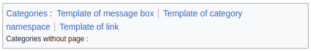
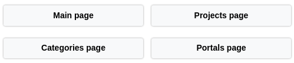

# Guide to develop and execute modular JavaScript in Obsidian

Whereas Markdown can only be used to produce static content, JavaScript **expands the possibilities of Obsidian** by enabling dynamic rendering. Its impact on performance is low and it reduces the need for additional plugins to add features. Furthermore, if the code is properly structured into JavaScript functions and externalized into external scripts, it **preserves the interoperability of markdown files** in case that you wish to migrate away from Obsidian. Indeed, it become unnecessary to go through the markdown files to modify and adapt them, as all you have to do is re-implements the few JavaScript functions located in the script files. It is these aspects that we are going to explore in this guide.

Here are a few examples of renderings created using JavaScript scripts with their call code from Markdown pages, which would be tedious to produce in pure Markdown :

- `Categories of the page` (inspired by Wikipedia, I use it as a footer on all my pages)

```js
await customJS.MacroCategoriesOfPage.listInBox(<dataview-plugin>, "<path-to-page>");
```



- `Navigation bar` ([inspired by Wikipedia](https://fr.wikipedia.org/wiki/Projet:Portail_et_projet/Onglets), I use it as a page header on some pages)

```js
await customJS.MacroNavigationBar.forWelcomePage(<dataview-plugin>);
```



- `Dynamic link` (the link target a local file located outside Obsidian and its root varies depending on the OS, which is impossible to do in markdown)

```js
customJS.MacroSysinfoLink.onTextToFile("<link-text>", "partial-path-to-file", "<file-format-indicator>")
```


- `Main article` ([inspired by Wikipédia](https://en.wikipedia.org/wiki/Template:Category_main_article))

```js
await customJS.MacroMainArticle.displayInBox(<plugin-dataview>, "<path-to-page>", "<link-text>");
```


## Introduction

To structure JavaScript code in Obsidian and avoid polluting markdown files, a good practice is to externalise it in interconnected script files, and to form object classes representing conceptual entities of which only certain functions will be called in the pages. These classes will be of two types:

- **modules** : not intended to be used directly in markdown files, these classes encapsulate the business logic and make their service functions available to macros.
- **macros** : these classes act as an interface between the modules and the markdown files, and their main role is to render in HTML. Their functions are invoked in the pages using the [CustomJS plugin](https://github.com/saml-dev/obsidian-custom-js).

In this guide, we will see how to run JavaScript code inside Obsidian Markdown files, and how to set up an Obsidian macro system to externalise code into dedicated script files and manage their dependencies. In addition, to make it easier to write this code, we will see how to set up a development environment.

The proposed **macro system** is not technically revolutionary. It is essentially a method of organisation for Obsidian that aims to standardise and externalise your JavaScript functions, in order to reduce code redundancy and minimise maintenance time.  It is directly inspired by the [Wikipedia module and model system](https://en.wikipedia.org/wiki/Wikipedia:Templates).

### Prerequisites

This guide is written for people who are already somewhat familiar with Obsidian and who have some knowledge of JavaScript and software development. You don't need to be a software engineer, but at least have already developed a little in JavaScript and optionally know what an [IDE](https://en.wikipedia.org/wiki/Integrated_development_environment) is and in particular [Visual Studio Code](https://code.visualstudio.com/).

For this guide you **need to install** :

- the Obsidian [*Dataview*](https://blacksmithgu.github.io/obsidian-dataview/) plugin for executing JavaScript in markdown pages,
- the Obsidian [*CustomJS*](https://github.com/saml-dev/obsidian-custom-js) plugin for externalizing JavaScript code and calling it.

If you want to configure a development environment, you need to **optionally install** :

- the IDE [Visual Studio Code](https://code.visualstudio.com/) IDE.
- the environment [NodeJS](https://docs.npmjs.com/downloading-and-installing-node-js-and-npm) (optional but recommended to take advantage of the auto-completion of the Obsidian API in the IDE).

## Executing JavaScript code in Obsidian

The Dataview plugin provides [two syntaxes](https://blacksmithgu.github.io/obsidian-dataview/queries/dql-js-inline/#dataview-js) for embedding JavaScript in a markdown file.

The **first syntax** produces a rendering in a dedicated block (a `div`) that is separated from the text before and after it:

````markdown
```dataviewjs
// here my code
```
````

For example, the following markdown code :

````markdown
Text before.

```dataviewjs
dv.span("You read the page: " + dv.fileLink(dv.current().file.path, false, "Guide for Obsidian")) + ".";
```

Text after.
````

Display:


The **second syntax** is called *inline* and produces a rendering within the text before and after :

```markdown
`$= // here my code`
```

For example, the following markdown code :

````markdown
Text before. `$= "You read the page: " + dv.fileLink(dv.current().file.path, false, "Guide for Obsidian") + ".";` Text after.
````

Display:


The **code is executed when you switch to *Live preview* or *Reading*** view. It is therefore recommended to write it in *Source mode*.

For performance reasons, the code is not reinterpreted each time the view is changed, but at regular intervals or when modifications are made.

> [!tip] Tip
> To force reinterpretation of the code without modifying it, add the `;` character to the end of a line. This character is optional in JavaScript and can be found in multiple copies in a row without causing any problems. Then, when your tests are complete, delete the excess characters.

## Externalise JavaScript code in script files

Writing all the JavaScript code only in markdown files will quickly make your files unreadable, and above all, make code maintenance difficult and lead to a lot of redundancy. That's why it's recommended that you move it to script files located in a subfolder of the Obsidian vault, then invoke them in the markdown pages using the [CustomJS plugin](https://github.com/saml-dev/obsidian-custom-js).

The **approach to outsourcing code** is as follows:

1. In Obsidian, create a sub-folder for the JavaScript files. For example, in my case it's `03-Files/scripts_customjs`, next to my other assets.

    

2. In the Obsidian options, go to the CustomJS configuration parameters.

3. Initialise the *Folder* parameter with the path to the folder created earlier (for example `03-Files/scripts_customjs`). Close the options window.

4. Using File Explorer, open this folder, then create a new file suffixed with the `.js` extension. For example `my-script.js`. The filename *must not* contain any spaces or special characters.

5. Using a text editor or code-editing software, open this file and paste the following demonstration code:

    ```js
    class MacroGuide {
      /**
      * @param {object} dv DataView object of Obsidian extension.
      */
      helloWorld(dv) {
        const { obsidian, app } = self.customJS || {};
        if (obsidian == null || app == null) throw new Error("customJS is null.");

        dv.span(
          "You read the page: " +
            dv.fileLink(dv.current().file.path, false, "Guide for Obsidian")
        ) + ".";
      }
    }
    ```

6. Save and close the text editor.

7. In an Obsidian page, insert the following script invocation code:

    ````js
    ```dataviewjs
    customJS.MacroGuide.helloWorld(dv);
    ```
    ````

8. Switch to *Live Preview* or *Reading* to view the rendering. A sentence containing a link to the current page should be displayed. The rendering is identical to the first method in the previous part, but this time the business logic is externalized.

**A few comments:**

At step 6, you can see that the `helloWorld()` function is **encapsulated in a class**. This is a constraint imposed by CustomJS, which will trigger an error if it is not respected. In any way, even if this were not the case, this practice is strongly recommended to take advantage of the readability benefits offered by the Object paradigm.

Secondly, the CustomJS plugin gives access to [two objects](https://github.com/saml-dev/obsidian-custom-js) which are essential for interacting with Obsidian:

- `customJS.obsidian`: provides access to the [Obsidian API](https://github.com/obsidianmd/obsidian-api/blob/master/obsidian.d.ts).
- `customJS.app`: provides access to the [App object](https://docs.obsidian.md/Reference/TypeScript+API/App).

Finally, to **access to the Dataview object from a function**, you will need to pass it the global variable `dv` as a parameter.

## Configuring the development environment

**Note:** this part is optional. If you don't want to work with an IDE, you can skip this part.

Writing JavaScript code in a simple text editor will quickly become tedious and be the source of many syntax errors without a checking tool. The advantage of an IDE such as [Visual Studio Code for JavaScript](https://code.visualstudio.com/docs/languages/javascript) is that it offers syntax highlighting, but above all **[auto-completion](https://en.wikipedia.org/wiki/Autocomplete) mechanisms** that will save you a huge amount of time.

The procedure for **configuring the development environment** is as follows:

1. From a terminal, install the NodeJS package of [`Obsidian API`](https://www.npmjs.com/package/obsidian).

2. Launch Visual Studio Code, then open your Obsidian vault folder.

3. In the folder where the CustomJS scripts folder is already located, create a file named `jsconfig.json`. This allows you to [configure a JavaScript project in VS Code](https://code.visualstudio.com/docs/languages/jsconfig) to take advantage of auto-completion with the Obsidian API and JavaScript.

4. Paste the following content into this file:

    ```json
    {
      "compilerOptions": {
        "module": "ESNext",
        "moduleResolution": "Bundler",
        "target": "ES2022",
        "jsx": "react",
        "allowImportingTsExtensions": true,
        "checkJs": true,
        "allowJs": true,
        "experimentalDecorators": true,
        "strictNullChecks": true,
        "strictFunctionTypes": true,
        "baseUrl": ".",
        "paths": {
          "obsidian": ["../../../../../.nvm/versions/node/v20.13.1/lib/node_modules/obsidian/obsidian.d.ts"],
          "custom-js": ["../.obsidian/plugins/customjs/types.d.ts"]
        }
      },
      "exclude": [
        "node_modules",
        "**/node_modules/*"
      ]
    }
    ```

5. In the `obsidian` variable, check that the path points to the type definition in the Obsidian NodeJS package.

You should now have auto-completion when developing scripts. In the rest of the guide, we'll be coming back to modify this file to add our scripts in order to have auto-completion on our own classes.

> [!tip] Suggestion
> Put the `// @ts-check` instruction at the beginning of each JavaScript file to detect syntax errors.

## Structuring its scripts and managing dependencies

The [Decomposition](<https://en.wikipedia.org/wiki/Decomposition_(computer_science)>) is a fundamental principle in software engineering. When applied with an object language like modern JavaScript, it involves subdividing business domains into conceptual entities called classes. A class groups together and provides all the services expected of an entity via its functions (or methods). This is what this section proposes to put in place. This paradigm greatly improves the maintainability and readability of the code by avoiding a lot of code redundancy. On the other hand, it will mean having to manage dependencies between scripts.

A good engineering practice is to have **one object class per file**. For the record, there are two types of class in this macro system.

**Module classes**, which are not intended to be used directly in markdown files, and which encapsulate the business logic and provide macros with their service functions. And **Macro classes**, which act as an interface between the modules and the markdown files using the [CustomJS plugin](https://github.com/saml-dev/obsidian-custom-js), and whose main role is to render HTML files.

The **macros** are all located in the single folder configured in customJS:


**Modules** are grouped by business area in folders next to the macros folder. For example:


The **script import and export** is done using the [import/export mechanism](https://developer.mozilla.org/en-US/docs/Web/JavaScript/Guide/Modules) provided by the JavaScript API. Except that where the simple keywords `export/import` or `require` are sufficient in pure JavaScript, the permissiveness of the customJS plugin means that you have to use a roundabout method that we will see later.

### Naming module folders

Module folders can be named anything as long as they **share a common prefix** for the import/export mechanism, and have no spaces or special characters.

I have chosen the `scripts_module_<domain>` convention.

### Centralizing its configurations

It may be a good idea to create a configuration script for scripts, which centralises the main information about the Obsidian vault in order to reduce the impact that any changes to the vault would have on the code. I recommend putting at least the paths to the main folders.

Its path could be `scripts_module_common/config.js` and its minimal structure :

```js
/**
 * @description Module for all config variables.
 * @module Config
 */

// @ts-check

module.exports = {
  myVar: "my-value"
};
```

> [!EXAMPLE]- Example of configuration file
>
> ```js
> /**
>  * @description Module for all config variables.
>  * @module Config
>  */
> 
> // @ts-check
> 
> module.exports = {
>   obsidianFolderPaths: {
>     article: "01-Articles",
>     project: "02-Projects",
>     file: "03-Files",
>     tags: "04-Tags",
>     template: "05-Templates",
>     templateSource: "05-Templates/Source",
>     special: "06-Special",
>     user: "07-User",
>     help: "08-Help",
>     archives: "09-Archives",
>   },
>   fsRootPaths: {
>     linux: "/home/name/", // Root path on Linux File System
>     windows: "%userprofile%/", // Root path on Windows File System
>     android: "", // Root path on Android File System
>     mac: "", // Root path on Mac File System
>     ios: "", // Root path on iOS File System
>   },
> };
> ```

### Exporting a script

To export, use the `module.exports = ...` syntax from [CommonJS specification](https://flaviocopes.com/commonjs/) also used in [NodeJS](https://nodejs.org/api/modules.html#exports-shortcut), preferably at the end of the :

```js
class MyClass {
// my code
}

module.exports = MyClass;
```

You can export several values by creating a JavaScript literal object:

```js
class MyClass {
// my code
}
const MY_CONST = "value";

module.exports = {
  MyClass,
  MY_CONST,
  myVar: "value",
}
```

Despite repeated attempts, the ES6 import/export syntax does not seem to be supported by the CustomJS plugin. Only the NodeJS syntax works.

### Importing a script

While in pure JavaScript import is easily done using the `import` or `require` keywords, CustomJS raises an error when using them. So you need to be a bit tricky and encapsulate the `require` function in another static function.

```js
/**
 * @param {string} moduleFolderSuffix Suffixe name of one of folder module in `/03-Files/scripts_module_<suffixe>/` folders.
 * @param {string} moduleFile Name of the file module in the `/03-Files/scripts_module_<suffixe>/` folder.
 * @returns {any} Exported module.
 */
static importModule(moduleFolderSuffix, moduleFile) {
  const { obsidian, app } = self.customJS || {};
  if (obsidian == null || app == null) throw new Error("customJS is null.");
  let adapter = app.vault.adapter;
  if (adapter instanceof obsidian.FileSystemAdapter) {
    const modulePath =
      adapter.getBasePath() +
      "/03-Files/scripts_module_" +
      moduleFolderSuffix +
      "/" +
      moduleFile;
    delete global.require.cache[global.require.resolve(modulePath)];
    return require(modulePath);
  }
  throw new Error("Obsidian adapter is not a FileSystemAdapter.");
}
```

The `importModule()` function will automatically look for modules in the sub-folders of `03-Files` prefixed with `scripts_module_`. As this prefix was determined in the previous section, you need to remember to modify the code accordingly.

There are two ways to **integrate `importModule` into a file**:

- Directly as a function of the main class.

    ```js
    class MacroGuide {
      /* -------------------------------------------------------------------------- */
      /*                                Import Section                              */
      /* -------------------------------------------------------------------------- */
      static importModule(moduleFolderSuffix, moduleFile) {
        // Code of function
      }
      /* -------------------------------------------------------------------------- */

      /**
      * @param {object} dv DataView object of Obisidian extension.
      */
      helloWorld(dv) {
        // My code
      }
    }
    ```

- Or in a specific class located before the main class, bearing in mind that this option **only works for classes located outside the CustomJS folder** (`scripts_customjs` in this article).

    ```js
    /* -------------------------------------------------------------------------- */
    /*                                Import Section                              */
    /* -------------------------------------------------------------------------- */

    class ModuleLoader {
      static importModule(moduleFolderSuffix, moduleFile) {
        // Code of function
      }
    }
    /* -------------------------------------------------------------------------- */

    class ClassOfModule {
      /**
      * @param {object} dv DataView object of Obisidian extension.
      */
      helloWorld(dv) {
        // My code
      }
    }
    ```

**Using the `importModule()` function** to import a class is done in almost the same way as in pure JavaScript : by initializing a variable with a call to the function in the import section. This variable is then used in the same way as in pure JavaScript.

- If you had chosen the first option :

    ```js
    class MacroGuide {
      /* -------------------------------------------------------------------------- */
      /*                                Import Section                              */
      /* -------------------------------------------------------------------------- */
      static importModule(moduleFolderSuffix, moduleFile) {
        // Code of function
      }
      
      Obsidian = MacroGuide.importModule(
        "common",
        "utility-obsidian.js"
      ); // Here I import the class UtilityObsidian presented in the appendix of this article.
      /* -------------------------------------------------------------------------- */
      
      /**
      * @param {object} dv DataView object of Obisidian extension.
      */
      helloWorld(dv) {
        // To call a static function
        const page = this.Obsidian.getFileByPath();

        // To instanciate a class
        const myObsidianObject = new this.Obsidian();
      }
    }
    ```

- If you had chosen the second option :

    ```js
    /* -------------------------------------------------------------------------- */
    /*                                Import Section                              */
    /* -------------------------------------------------------------------------- */

    class ModuleLoader {
      static importModule(moduleFolderSuffix, moduleFile) {
        // Code of function
      }
    }

    Obsidian = ModuleLoader.importModule(
        "common",
        "utility-obsidian.js"
      ); // Here I import the class UtilityObsidian presented in the appendix of this article.
    /* -------------------------------------------------------------------------- */

    class ClassOfModule {
      /**
      * @param {object} dv DataView object of Obisidian extension.
      */
      helloWorld(dv) {
        // To call a static function
        const page = Obsidian.getFileByPath();

        // To instanciate a class
        const myObsidianObject = new Obsidian();
      }
    }
    ```

> [!info] External packages
> It is possible to import any NodeJS module or package (`node:path`, `luxon`, etc.), provided it has already been imported by an Obsidian plugin. For that, use the NodeJS syntax directly. For example: `const path = require(‘node:path’);`.

### Configuring the IDE for auto-completion

**Note:** this part is optional and should only be followed if you have completed the previous part on configuring the IDE.

Because we cannot use the standard way of importing JavaScript objects, the IDE is unable to offer auto-completion. Also, you should see red highlighting all over your code. To activate auto-completion, you need to perform a few operations, in particular with [JSDoc](https://jsdoc.app/).

For each file with an export instruction :

1. Open the `jsconig.json` file, and indicate in the `path` variable an import alias and the path to the file to be imported. For example:

    ```json
    {
      "compilerOptions": {
        "paths": {
          "obsidian": ["../../../../../.nvm/versions/node/v20.13.1/lib/node_modules/obsidian/obsidian.d.ts"],
          "moment": ["../../../../../.nvm/versions/node/v20.13.1/lib/node_modules/moment/moment.d.ts"],
          "custom-js": ["../.obsidian/plugins/customjs/types.d.ts"],
          "module-category": ["scripts_module_tag/category.js"],
          "module-utility-obsidian": ["scripts_module_common/utility-obsidian.js"]
        }
      }
    }
    ```

2. In the importing JavaScript file, add a [declaration `@typedef`](https://jsdoc.app/tags-typedef) at the top of the import section with the import alias specified in the previous step, in the form `/** @typedef {import('alias')} Type */`. For example :

    ```js
    /* -------------------------------------------------------------------------- */
    /*                                Import Section                              */
    /* -------------------------------------------------------------------------- */

    /**
    * @typedef {import('custom-js')} CustomJS
    * @typedef {import('obsidian')} Obsidian
    * @typedef {import('obsidian').App} App
    * @typedef {import('obsidian').Notice} Notice
    * @typedef {import('obsidian').TAbstractFile} TAbstractFile
    * @typedef {import('obsidian').TFile} TFile
    * @typedef {import('obsidian').TFolder} TFolder
    * @typedef {import('module-category')} Category
    */

    // Declaration of `static importModule(moduleFolderSuffix, moduleFile){}`
    /* -------------------------------------------------------------------------- */
    ```

3. In the same file, but this time at the end of the import section, add a [declaration `@type`](https://jsdoc.app/tags-type) of the form `/** @type {typeof import('alias')} */` above the variable initialisations by a call to the `importModule()` function. For example:

    ```js
    /* -------------------------------------------------------------------------- */
    /*                                Import Section                              */
    /* -------------------------------------------------------------------------- */

    /**
    * @typedef {import('custom-js')} CustomJS
    * @typedef {import('obsidian')} Obsidian
    * @typedef {import('obsidian').App} App
    * @typedef {import('obsidian').Notice} Notice
    * @typedef {import('obsidian').TAbstractFile} TAbstractFile
    * @typedef {import('obsidian').TFile} TFile
    * @typedef {import('obsidian').TFolder} TFolder
    * @typedef {import('module-category')} Category
    */

    // Declaration of `static importModule(moduleFolderSuffix, moduleFile){}`

    /** @type {typeof import('module-utility-obsidian')} */
    const Obsidian = ModuleLoader.importModule("common", "utility-obsidian.js");
    /** @type {typeof import('module-category')} */
    const Category = ModuleLoader.importModule("tag", "category.js");
    /* -------------------------------------------------------------------------- */
    ```

After these steps you should no longer have red highlights and you should have auto-completion for your classes.

**Note:** it is not necessary to follow steps 2 and 3 for each import. Depending on whether the functions called are static or not, and whether the imported classes are instantiated or not, you should carry out one of the two steps (as for my `utility-obsidian.js` module) or sometimes both (as for my `module-category` module) depending on what the IDE indicates.

## Generating HTML with JavaScript

One of the main advantages of using JavaScript in Obsidian is the ability to dynamically generate HTML content. The easiest way to do this (and perhaps the only way without a plugin) is to use the [Dataview JavaScript API](https://blacksmithgu.github.io/obsidian-dataview/api/code-reference/).

> [!warning] Impact on performance
> While executing JavaScript for data processing has very little impact on performance, this is not the case for generating HTML rendering. It can very easily add a few seconds to the loading time of a page, depending on your hardware configuration. A drop in performance is particularly noticeable when you have to generate a list containing several hundred links.

### The fundamental rendering functions

- `dv.el(element, text) : HTMLElement` : render arbitrary text in the given html element ("p", "ul", "li", etc.). This function return the rendered [HTMLElement](https://developer.mozilla.org/en-US/docs/Web/API/HTMLElement).

    ```js
    dv.el("b", "This is some bold text");
    ```

- `dv.el(element, text, { container: HTMLElement, cls: "first-css-class second-css-class", attr: { alt: "my value" } }) : HTMLElement;` : it is possible to specify a parent [HTMLElement container](https://developer.mozilla.org/en-US/docs/Web/API/HTMLElement) via `container`, a custom CSS classes to add to the element via `cls`, and additional attributes via `attr`. The parent container is the Dataview container `dv.container`.

    ```js
    async renderList(dv) {
      // Add CSS class to Dataview div block.
      dv.container.className += " my-css-class";

      // Render a list.
      const div = dv.el("div", "Here is my list: ", {
        container: dv.container,
        cls: "my-class-for-list",
      });
      const ul = dv.el("ul", "", {
        container: div,
      });
      ul.innerText = ""; // a "bug" into Dataview add an extra span everywhere when there is an empty string, here we remove it.

      for (let index = 0; index < 10; index++)
        dv.el("li", index, { container: ul, cls: "my-class-for-item" });
    }
    ```

- `dv.header(level, text)` : render a header of level 1 to 6 with the given text.

    ```js
    dv.header(1, "Big!"); // alias of dv.el(h1, "Big!");
    dv.header(6, "Tiny");// alias of dv.el(h6, "Tiny!");
    ```

- `dv.paragraph(text)` : render arbitrary text in a paragraph.

    ```js
    dv.paragraph("This is some text"); // alias of dv.el(p, "This is some text");
    ```

- `dv.span(text)` : render arbitrary text in a span (no padding above/below, unlike a paragraph).

    ```js
    dv.span("This is some text"); // alias of dv.el(span, "This is some text");
    ```

> [!tip] Recommendation
> Since the last three functions are simply aliases of the first and offer fewer options than the first, I recommend using only the `dv.el()` syntax.

It is **not necessary to use these Dataview functions** to render HTML. Instead, you can go directly to the [Obsidian API](https://docs.obsidian.md/Plugins/User+interface/HTML+elements) and its `createEl()` function, accessible from a [HTMLElement](https://developer.mozilla.org/en-US/docs/Web/API/HTMLElement), as soon as you have access to the main `dv.container` container:

```js
const book = dv.container.createEl("div");
book.createEl("div", { text: "How to Take Smart Notes" });
book.createEl("small", { text: "Sönke Ahrens" });
```

Dataview also uses this syntax for its `dv.el()` rendering function.

### The case of collections and lists

Dataview provides several [functions for displaying data sets](https://blacksmithgu.github.io/obsidian-dataview/api/code-reference/#dataviews): `dv.list()`, `dv.table()` etc. These are very useful when you want to write JavaScript directly to Markdown files while limiting the number of lines of code, and its [Proxy system](https://developer.mozilla.org/en-US/docs/Web/JavaScript/Reference/Global_Objects/Proxy) also makes it very easy to manipulate the data contained in collections. However, there are at least two limitations.

The **first limitation** is that they have **a cost in terms of performance**, which is admittedly low in terms of rendering times, but which exists despite the fact that there is a data cache. It is therefore important to understand how this system works and to identify in which cases it is relevant or not.

To handle data sets, Dataview provides a [data structure called `DataArray`](https://blacksmithgu.github.io/obsidian-dataview/api/data-array/). Each set or subset is a `DataArray` object. You can see what this object looks like by opening the console with `CTRL` + `SHIFT` + `I`, then inserting and executing the following code in an Obsidian page:

````js
```dataviewjs
console.log(dv.pages());
```
````

This structure can be quite overkill in simple cases where, for example, you only need to list the pages present in a folder. Although Dataview's caching system makes it easy to use, there are some cases where using the [Obsidian API](https://docs.obsidian.md/Reference/TypeScript+API) directly is more interesting. This is why you will find **in the appendix a utility class** which provides high-level functions **to interact with the Obsidian API**.

The **second limitation** of Dataview's dataset handling features is the impossibility of customizing the rendering with a CSS class or parent container other than `dv.container`. This greatly limits the possibilities of what can be done in HTML. The only alternative is to implement the lists yourself, as we did in the previous section.

## A full example of a module and macro

The proposed example is a macro called `MacroTagsOfPages`, which displays in a frame the list of tags in the `tags` property of the page. It is inspired by Wikipedia footers (as can be seen, for example, on the [Obsidian page](<https://en.wikipedia.org/wiki/Obsidian_(software)>)). This macro is based on the `UtilityObsidian` module, and its style is defined by the `.macro-tags-of-page` CSS class. **The full source code is provided in the appendix**.


To **test this example in Obsidian** :

1. In the customJS scripts folder (for example `scripts_customjs`), create a file called `macro-tags-of-pages.js`, which will contain the macro `MacroTagsOfPage`, then copy the corresponding source code provided in the appendix.

2. Next to the CustomJS scripts folder, create a new folder called `scripts_module_common`.

3. In this new folder, create a file called `utility-obsidian.js`, which will contain the `UtilityObsidian` module, then copy the corresponding source code provided in the appendix.

4. In the Obsidian CSS snippets folder, create a new file called `macro.css` and copy the source code of the style provided in the appendix.

5. In an Obsidian page containing some tags, add the following code to test the macro:

    ````js
    ```dataviewjs
    await customJS.MacroTagsOfPage.listInBox(dv, dv.current().file.path);;
    ```
    ````

Switching to *Live Preview* or *Reading* view should display the rendering.

## Appendix

### Script `utility-obsidian.js` with the module `UtilityObsidian`

Before using this code, make sure you update the module search path in the `importModule()` function.

```js
// @ts-check

/* -------------------------------------------------------------------------- */
/*                                Import Section                              */
/* -------------------------------------------------------------------------- */

/**
 * @typedef {import('custom-js')} CustomJS
 * @typedef {import('obsidian')} Obsidian
 * @typedef {import('obsidian').App} App
 * @typedef {import('obsidian').Notice} Notice
 * @typedef {import('obsidian').TAbstractFile} TAbstractFile
 * @typedef {import('obsidian').TFile} TFile
 * @typedef {import('obsidian').TFolder} TFolder
 */

class ModuleLoader {
  /**
   * @param {string} moduleFolderSuffix Suffixe name of one of folder module in `/03-Fichier/scripts_module_<suffixe>/` folders.
   * @param {string} moduleFile Name of the file module in the `/03-Fichier/scripts_module_<suffixe>/` folder.
   * @returns {any} Exported module.
   */
  static importModule(moduleFolderSuffix, moduleFile) {
    const { obsidian, app } = self.customJS || {};
    if (obsidian == null || app == null) throw new Error("customJS is null.");
    let adapter = app.vault.adapter;
    if (adapter instanceof obsidian.FileSystemAdapter) {
      const modulePath =
        adapter.getBasePath() +
        "/03-File/scripts_module_" +
        moduleFolderSuffix +
        "/" +
        moduleFile;
      delete global.require.cache[global.require.resolve(modulePath)];
      return require(modulePath);
    }
    throw new Error("Obsidian adapter is not a FileSystemAdapter.");
  }
}
/* -------------------------------------------------------------------------- */

class UtilityObsidian {
  // @ts-ignore
  static #notice = (msg) => new Notice(msg, 5000);
  static #log = (msg) => console.log(msg);
  static #noticeAndThrowError = (error) => {
    // @ts-ignore
    new Notice(error, 5000);
    throw new Error(error);
  };
  static #logAndThrowError = (error) => {
    console.log(error);
    throw new Error(error);
  };

  /**
   * Get all tags in the vault, with their number of occurrences.
   * @param {App} app A reference to the Obsidian `app`.
   * @returns {Map<string,number>} Map in the form `{ key: <tag-name>, value: <nb-occurrence> }`
   */
  static getAllTags(app) {
    // @ts-ignore
    return new Map(Object.entries(app.metadataCache.getTags()));
  }

  /**
   * Get the name of all tags in the vault.
   * @param {App} app A reference to the Obsidian `app`.
   * @returns {string[]} List of all tags in the vault.
   */
  static getAllTagNames(app) {
    // @ts-ignore
    return Object.keys(app.metadataCache.getTags());
  }

  /**
   * Create a new plaintext file inside the vault. Parent folder is also created if it does not exists.
   * @alias UtilityObsidian:createFileWithInput
   * @param {App} app A reference to the Obsidian `app`.
   * @param {Obsidian} obsidian A reference to the Obsidian API.
   * @param {string} filePath Vault absolute path for the new file, with extension.
   * @param {string} fileContent Text content for the new file.
   * @returns {Promise<TFile>}
   */
  static async createFileWithInput(app, obsidian, filePath, fileContent) {
    const dirMatch = filePath.match(/(.*)[/\\]/);
    /** @type {string} */
    let dirName = "";
    if (dirMatch) dirName = dirMatch[1];

    const dir = app.vault.getAbstractFileByPath(dirName);

    if (!dir || !(dir instanceof obsidian.TFolder)) {
      await UtilityObsidian.createFolder(app, dirName);
    }

    return await app.vault.create(filePath, fileContent);
  }

  /**
   * Create a new folder inside the vault.
   * @alias UtilityObsidian:createFolder
   * @param {App} app Obsidian app.
   * @param {string} folderPath Vault absolute path for the new folder.
   * @returns {Promise<TFolder|null>} The created folder or `null` if it already exists.
   */
  static async createFolder(app, folderPath) {
    const folderExists = await app.vault.adapter.exists(folderPath);

    /** @type {(TFolder|null)} */
    let newFolder = null;
    if (!folderExists) {
      newFolder = await app.vault.createFolder(folderPath);
    } else {
      UtilityObsidian.#log(`Folder ${folderPath} already exists.`);
    }

    return newFolder;
  }

  /**
   * Get paths of all folders in the vault.
   * @alias UtilityObsidian:getAllFolderPathsInVault
   * @param {App} app A reference to the Obsidian `app`.
   * @param {Obsidian} obsidian A reference to the Obsidian API.
   * @returns {string[]} List of paths of all folders in the vault.
   */
  static getAllFolderPathsInVault(app, obsidian) {
    return app.vault
      .getAllLoadedFiles()
      .filter((f) => f instanceof obsidian.TFolder)
      .map((folder) => folder.path);
  }

  /**
   * Get all folders in the vault.
   * @alias UtilityObsidian:getAllFoldersInVault
   * @param {App} app A reference to the Obsidian `app`.
   * @param {Obsidian} obsidian A reference to the Obsidian API.
   * @returns {TFolder[]} List of all folders in the vault.
   */
  static getAllFoldersInVault(app, obsidian) {
    return app.vault
      .getAllLoadedFiles()
      .filter((f) => f instanceof obsidian.TFolder);
  }

  /**
   * Get all markdown files in the vault.
   * @alias UtilityObsidian:getAllMarkdownFiles
   * @param {App} app A reference to the Obsidian `app`.
   * @returns {TFile[]} List of all markdown files in the vault.
   */
  static getAllMarkdownFilesInVault(app) {
    return app.vault.getMarkdownFiles();
  }

  /**
   * Get all files whose path begins with `folderPath`.
   * @param {App} app A reference to the Obsidian `app`.
   * @param {string} folderPath Path folder to explore.
   * @returns {TFile[]} List of all files found.
   */
  static getAllFilesInFolder(app, folderPath) {
    return app.vault
      .getFiles()
      .filter((file) => file.path.startsWith(`${folderPath}`));
  }

  /**
   * Get all markdown files whose path begins with `folderPath`.
   * @param {App} app A reference to the Obsidian `app`.
   * @param {string} folderPath Path folder to explore.
   * @returns {TFile[]} List of all markdown files found.
   */
  static getAllMarkdownFilesInFolder(app, folderPath) {
    return app.vault
      .getMarkdownFiles()
      .filter((file) => file.path.startsWith(`${folderPath}`));
  }

  /**
   * Check if something exists at the given path.
   * @alias UtilityObsidian:fileExists
   * @param {App} app Obsidian app.
   * @param {string} filePath Path to file.
   * @returns {Promise<boolean>}
   */
  static async fileExists(app, filePath) {
    return await app.vault.adapter.exists(filePath);
  }

  /**
   * Tries to move to system trash. If that isn't successful/allowed, use local trash.
   * @alias UtilityObsidian:removeFile
   * @param {App} app A reference to the Obsidian `app`.
   * @param {Obsidian} obsidian A reference to the Obsidian API.
   * @param {string} filePath Vault absolute path to the file, with extension, case sensitive.
   */
  static async removeFile(app, obsidian, filePath) {
    const file = app.vault.getAbstractFileByPath(filePath);
    if (file && file instanceof obsidian.TFile)
      await app.vault.trash(file, true);
  }

  /**
   * Get the list of tags inside the frontmatter property `file`.
   * @alias UtilityObsidian:getFrontMatterTags
   * @param {App} app A reference to the Obsidian `app`.
   * @param {Obsidian} obsidian A reference to the Obsidian API.
   * @param {TFile} file Vault file to parse.
   * @returns {string[]} Tags inside the frontmatter of `file`.
   */
  static getFrontMatterTags(app, obsidian, file) {
    const fileFrontMatter = app.metadataCache.getFileCache(file)?.frontmatter;
    if (!fileFrontMatter) return [];

    const fileTags = obsidian.parseFrontMatterTags(fileFrontMatter);
    if (!fileTags) return [];

    return fileTags;
  }

  /**
   * Get the list of alias inside the frontmatter property `alias`.
   * @alias UtilityObsidian:getFrontMatterAliases
   * @param {App} app A reference to the Obsidian `app`.
   * @param {Obsidian} obsidian A reference to the Obsidian API.
   * @param {TFile} file Vault file to parse.
   * @returns {string[]} Aliases inside the frontmatter of `file`.
   */
  static getFrontMatterAliases(app, obsidian, file) {
    const fileFrontMatter = app.metadataCache.getFileCache(file)?.frontmatter;
    if (!fileFrontMatter) return [];

    const fileAliases = obsidian.parseFrontMatterAliases(fileFrontMatter);
    if (!fileAliases) return [];

    return fileAliases;
  }

  /**
   * Get inside the frontmatter the value of the property `propertyName`.
   * @param {App} app A reference to the Obsidian `app`.
   * @param {Obsidian} obsidian A reference to the Obsidian API.
   * @param {TFile} file Vault file to parse.
   * @param {string} propertyName Property name of the value to get.
   * @returns {any} Value inside the frontmatter of `file`.
   * @throws {Error} If the property doesn't exists.
   */
  static getFrontMatterEntry(app, obsidian, file, propertyName) {
    const fileFrontMatter = app.metadataCache.getFileCache(file)?.frontmatter;
    if (!fileFrontMatter) return [];

    const propertyValue = obsidian.parseFrontMatterEntry(
      fileFrontMatter,
      propertyName
    );
    if (propertyValue == null)
      throw new Error(
        `The property ${propertyName} doesn't exists in the file ${file.path}.`
      );

    return propertyValue;
  }

  /**
   * Get a file inside the vault at the given path.
   * @alias UtilityObsidian:getFileByPath
   * @param {App} app A reference to the Obsidian `app`.
   * @param {Obsidian} obsidian A reference to the Obsidian API.
   * @param {string} filePath Vault absolute path to the file, with extension, case sensitive.
   * @returns {TFile}
   * @throws {Error} If file not found, file is a folder, or file is not a file.
   */
  static getFileByPath(app, obsidian, filePath) {
    const file = app.vault.getAbstractFileByPath(filePath);

    if (!file) {
      UtilityObsidian.#log(`'${filePath}' not found.`);
      throw new Error(`'${filePath}' not found.`);
    }

    if (file instanceof obsidian.TFolder) {
      UtilityObsidian.#log(`'${filePath}' found but it's a folder.`);
      throw new Error(`'${filePath}' found but it's a folder.`);
    }

    if (!(file instanceof obsidian.TFile)) {
      UtilityObsidian.#log(`${filePath} is not a file.`);
      throw new Error(`${filePath} is not a file.`);
    }

    return file;
  }

  /**
   * Get a folder inside the vault at the given path.
   * @alias UtilityObsidian:getFolderByPath
   * @param {App} app A reference to the Obsidian `app`.
   * @param {Obsidian} obsidian A reference to the Obsidian API.
   * @param {string} folderPath Vault absolute path to the folder, with extension, case sensitive.
   * @returns {TFolder}
   * @throws {Error} If folder not found, folder is a file, or folder is not a folder.
   */
  static getFolderByPath(app, obsidian, folderPath) {
    const folder = app.vault.getFolderByPath(folderPath);

    if (!folder) {
      UtilityObsidian.#log(`'${folderPath}' not found`);
      throw new Error(`'${folderPath}' not found.`);
    }

    if (folder instanceof obsidian.TFile) {
      UtilityObsidian.#log(`'${folderPath}' found but it's a file.`);
      throw new Error(`'${folderPath}' found but it's a file.`);
    }

    if (!(folder instanceof obsidian.TFolder)) {
      UtilityObsidian.#log(`'${folderPath}' is not a folder.`);
      throw new Error(`'${folderPath}' is not a folder.`);
    }

    return folder;
  }

  /**
   * Trigger an update of a file in the cache.
   * @alias UtilityObsidian:cacheUpdate
   * @param {App} app Obsidian app.
   * @param {TFile} targetFile Vault file to update.
   * @returns {Promise<void>}
   */
  static cacheUpdate(app, targetFile) {
    return new Promise((resolve, reject) => {
      const timeout = setTimeout(() => reject("Cache update timeout"), 500);
      const resolvePromise = (file) => {
        if (file === targetFile) {
          clearTimeout(timeout);
          app.metadataCache.off("changed", resolvePromise);
          resolve();
        }
      };
      app.metadataCache.on("changed", resolvePromise);
    });
  }

  /**
   * Move a file safely, and update all links to it depending on the user's preferences.
   * @param {App} app A reference to the Obsidian `app`.
   * @param {Obsidian} obsidian A reference to the Obsidian API.
   * @param {TFile} fileToMove The file to move.
   * @param {TFolder} newParent The folder to which the file will be moved.
   * @throws {Error} If the new parent doesn't exists.
   */
  static async moveFile(app, obsidian, fileToMove, newParent) {
    const newParentPath = newParent.path;
    const folderExists = await app.vault.adapter.exists(newParentPath);
    if (!folderExists) {
      UtilityObsidian.#log(`The folder '${newParentPath}' doesn't exists.`);
      throw new Error(`The folder '${newParentPath}' doesn't exists.`);
    }
    const newFilePath = obsidian.normalizePath(
      `${newParentPath}/${fileToMove.name}`
    );
    await app.fileManager.renameFile(fileToMove, newFilePath);
  }

  /**
   * Renames the file (keeps the same file extension).
   * @param {App} app A reference to the Obsidian `app`.
   * @param {Obsidian} obsidian A reference to the Obsidian API.
   * @param {TFile} fileToRename The file to rename.
   * @param {string} newFileName The new file name without the file extension, which will be deducted from `fileToRename`.
   * @throws {Error} If the new file name contains `\`, `/` or `:`.
   */
  static async renameFile(app, obsidian, fileToRename, newFileName) {
    if (newFileName.match(/[\\/:]+/g)) {
      UtilityObsidian.#log(
        `File name ${newFileName} cannot contain any of these characters: \\ / :`
      );
      throw new Error(
        `File name ${newFileName} cannot contain any of these characters: \\ / :`
      );
    }

    const newFilePath = obsidian.normalizePath(
      `${fileToRename.parent?.path}/${newFileName}.${fileToRename.extension}`
    );
    await app.fileManager.renameFile(fileToRename, newFilePath);
  }

  /**
   * Insert a `text` at the cursor position.
   * @param {App} app A reference to the Obsidian `app`.
   * @param {string} text Text to insert at the cursor position.
   * @throws {Error} If no active editor.
   */
  static insertAtCursorPosition(app, text) {
    const activeEditor = app.workspace.activeEditor;
    if (!activeEditor || !activeEditor.file || !activeEditor.editor)
      UtilityObsidian.#noticeAndThrowError("No active editor.");

    // @ts-ignore
    const editor = activeEditor.editor;
    // @ts-ignore
    editor.replaceRange(text, editor.getCursor());
  }

  /**
   * Replace the selectioned text by `replacement` text.
   * @param {App} app A reference to the Obsidian `app`.
   * @param {string} replacement Text in replacement of selection.
   * @throws {Error} If no active editor.
   */
  static replaceSelection(app, replacement) {
    const activeEditor = app.workspace.activeEditor;
    if (!activeEditor || !activeEditor.file || !activeEditor.editor)
      UtilityObsidian.#noticeAndThrowError("No active editor.");

    // @ts-ignore
    const editor = activeEditor.editor;
    // @ts-ignore
    const doc = editor.getDoc();
    doc.replaceSelection(replacement);
  }

  /**
   * Get the select text in the current page.
   * @param {App} app A reference to the Obsidian `app`.
   * @param {Obsidian} obsidian A reference to the Obsidian API.
   * @returns {string} The selected texte or empty.
   * @throws {Error} If no active view.
   */
  static getSelectedText(app, obsidian) {
    const activeView = app.workspace.getActiveViewOfType(obsidian.MarkdownView);
    if (!activeView)
      UtilityObsidian.#noticeAndThrowError(
        "No active view - could not get selected text."
      );

    return activeView?.editor.getSelection() ?? "";
  }
}

module.exports = UtilityObsidian;
```

### Script `macro-tags-of-pages.js` with the macro `MacroTagsOfPage`

Before using this code, make sure you update the module search path in the `importModule()` function.

```js
// @ts-check

class MacroTagsOfPage {
  /* -------------------------------------------------------------------------- */
  /*                                Import Section                              */
  /* -------------------------------------------------------------------------- */

  /**
   * @typedef {import('custom-js')} CustomJS
   * @typedef {import('obsidian')} Obsidian
   * @typedef {import('obsidian').App} App
   * @typedef {import('obsidian').Notice} Notice
   * @typedef {import('obsidian').TAbstractFile} TAbstractFile
   * @typedef {import('obsidian').TFile} TFile
   * @typedef {import('obsidian').TFolder} TFolder
   */

  /**
   * @param {string} moduleFolderSuffix Suffixe name of one of folder module in `/03-Fichier/scripts_module_<suffixe>/` folders.
   * @param {string} moduleFile Name of the file module in the `/03-Fichier/scripts_module_<suffixe>/` folder.
   * @returns {any} Exported module.
   */
  static importModule(moduleFolderSuffix, moduleFile) {
    const { obsidian, app } = self.customJS || {};
    if (obsidian == null || app == null) throw new Error("customJS is null.");
    let adapter = app.vault.adapter;
    if (adapter instanceof obsidian.FileSystemAdapter) {
      const modulePath =
        adapter.getBasePath() +
        "/03-File/scripts_module_" +
        moduleFolderSuffix +
        "/" +
        moduleFile;
      delete global.require.cache[global.require.resolve(modulePath)];
      return require(modulePath);
    }
    throw new Error("Obsidian adapter is not a FileSystemAdapter.");
  }

  /** @type {typeof import('module-utility-obsidian')} */
  Obsidian = MacroTagsOfPage.importModule("common", "utility-obsidian.js");
  /** @type {typeof import('module-config')} */
  Config = MacroTagsOfPage.importModule("common", "config.js");
  /* -------------------------------------------------------------------------- */

  /**
   * Print a box in HTML with the list of tags of a page `pagePath`.
   * @param {object} dv DataView object of Obisidian extension.
   * @param {string} pagePath Vault absolute path to the page with tags, with extension.
   * @returns {Promise<void>} A box in HTML with a list of tags.
   */
  async listInBox(dv, pagePath) {
    // Add CSS class to global div.
    dv.container.className += " macro-tags-of-page";

    // Render the list.
    const div = dv.el("div", "Tags: ", {
      container: dv.container,
      cls: "tags",
    });
    await this.#renderListOfTags(dv, div, pagePath);
  }

  /**
   * Print the list of the tags of a page `pagePath` in using its metadata `tags`.
   * @param {object} dv DataView object of Obisidian extension.
   * @param {object} container Parent HTML container.
   * @param {string} pathToPage Vault absolute path to the page with tags (or not), with extension.
   */
  async #renderListOfTags(dv, container, pathToPage) {
    const { obsidian, app } = self.customJS || {};
    if (obsidian == null || app == null) throw new Error("customJS is null.");

    // Get data
    const page = this.Obsidian.getFileByPath(app, obsidian, pathToPage);
    const pageTagNames = this.Obsidian.getFrontMatterTags(
      app,
      obsidian,
      page
    ).sort();

    // Render the list.
    const ul = dv.el("ul", "", {
      container: container,
    });
    ul.innerText = "";
    for (const pageTagName of pageTagNames) {
      dv.el("li", pageTagName, {
        container: ul,
      });
    }
  }
}
```

### Style CSS `macro.css` containing the class `.macro-tags-of-page`

```css
div.macro-tags-of-page {
  --line-height-medium: 1.5714285;
  --background-color-neutral-subtle: #f8f9fa;
  --color-base: #202122;
  --border-color-base: #a2a9b1;
  --color-progressive: #36c;
  --color-progressive--hover: #447ff5;
  --color-visited: #6b4ba1;

  /* Remove theme style */
  box-sizing: unset;

  /* New style */
  line-height: var(--line-height-medium);
  background: var(--background-color-neutral-subtle);
  font-family: sans-serif;
  color: var(--color-base);
  caret-color: var(--color-base);
  border: 1px solid var(--border-color-base);
  margin-top: 1em;
  padding: 5px;
  clear: both;

  ul {
    display: inline;
    margin: 0;
    padding: 0;
    list-style: none;

    > li {
      display: inline;
      line-height: 1.25em;
      margin: 0.125em 0;
      border-left: 1px solid var(--border-color-base);
      padding: 0 0.5em;
    }
    > li:first-child {
      border-left: 0;
      padding-left: 0.25em;
    }
  }
  a {
    color: var(--color-progressive);
    font-weight: inherit;
    border-radius: 2px;
    text-decoration: none;
    &:hover {
      color: var(--color-progressive--hover);
      text-decoration: underline;
    }
    &:visited {
      color: var(--color-visited);
    }
  }
  a.tag {
    background: unset;
    border: unset;
    font-size: unset;
    padding: unset;
    line-height: unset;
  }
}
```
